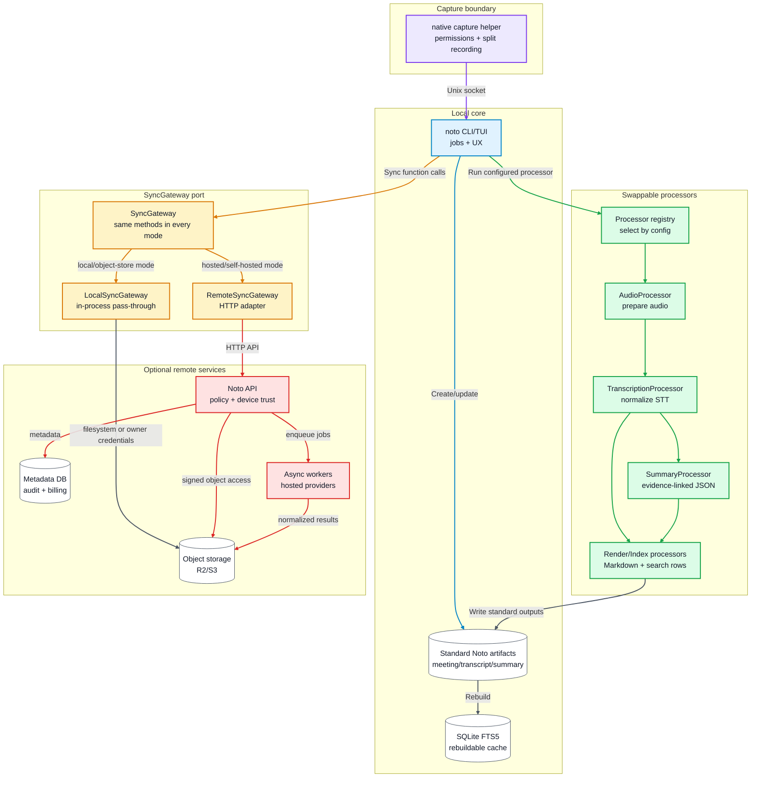

# ADR 0001: Local-First Modular Architecture

Date: 2026-04-24

## Status

Accepted for planning.

V1 implements local capture, TUI, artifacts, provider transcription, summaries,
and search. Sync, hosted API, and hosted provider routing are later phases of
this architecture.

## Context

Noto must record meetings on macOS, work without hosted infrastructure, produce
portable artifacts, and support future SaaS or self-hosted team deployments
without splitting sync into separate product architectures.

## Decision

Use a local-first modular architecture:

- The native macOS capture helper owns permissions, split mic/system capture, and minimal recording state.
- `noto` owns CLI/TUI workflows, local jobs, artifact writes, processors, search, and providers.
- `~/Noto` stores durable JSON, Markdown, checksums, prompts, and local indexes.
- SQLite FTS5 is a rebuildable local search cache.
- Replaceable processors transform inputs into standard Noto artifacts.
- Post-V1, a single sync/control gateway owns storage access, policy checks, manifest updates, and job submission.
- The gateway can run as an in-process local pass-through or as a remote Noto API.
- The remote Noto API adds auth, device policy, signed object access, provider routing, audit, and billing.

## Consequences

- Local use never depends on SaaS availability.
- Local, hosted, and self-hosted modes reuse the same sync workflow and artifact contract.
- Providers and processors can be swapped without changing downstream artifact consumers.
- Remote API request handlers can stay lightweight because large artifacts go directly to object storage.
- More adapter boundaries are required early: capture, artifact store, providers, and future sync/control gateway.

## Rejected Alternatives

| Alternative                  | Reason                                                                                                                               |
| ---------------------------- | ------------------------------------------------------------------------------------------------------------------------------------ |
| TUI-only recorder            | Weak macOS permission UX and fragile recording lifetime.                                                                             |
| Required cloud backend       | Breaks local-first and offline use.                                                                                                  |
| R2 as database               | Object storage is not a query, lock, or patch system.                                                                                |
| Electron app                 | Heavy and still needs a native capture bridge.                                                                                       |
| Live-first transcript system | Adds streaming complexity before post-meeting value is proven.                                                                       |
| Supabase as default backend  | Useful for prototypes, but a small Noto API plus Postgres/object storage gives clearer tenancy, billing, audit, and export behavior. |

## References

- [Apple ScreenCaptureKit capture sample](https://developer.apple.com/documentation/ScreenCaptureKit/capturing-screen-content-in-macos)
- [Cloudflare R2 consistency](https://developers.cloudflare.com/r2/reference/consistency/)
- [Cloudflare R2 presigned URLs](https://developers.cloudflare.com/r2/api/s3/presigned-urls/)
- [Cloudflare Workers limits](https://developers.cloudflare.com/workers/platform/limits/)
- [Supabase self-hosting](https://supabase.com/docs/guides/self-hosting)
