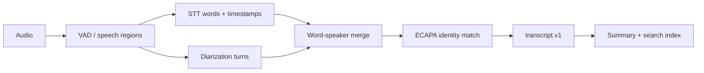
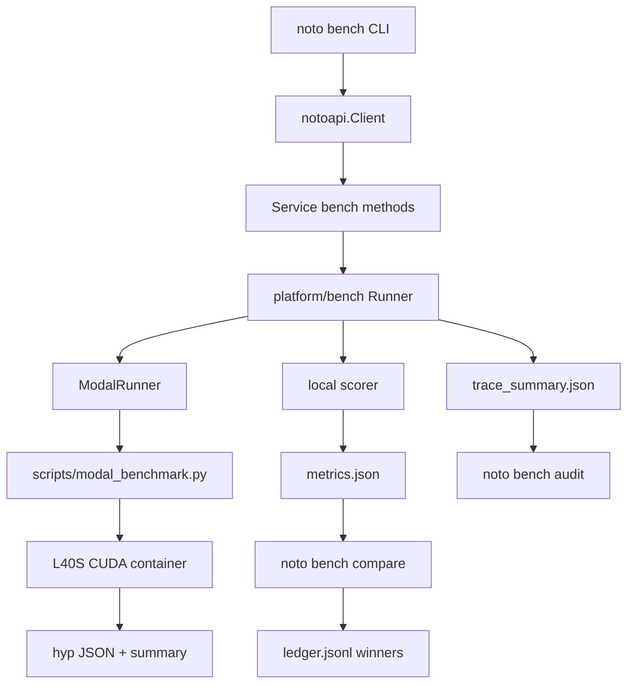

# Speech Compute Architecture

Noto's speech compute stack turns meeting audio into an attributed transcript
that can be summarized, searched, and linked to persistent speaker profiles.
The system is local-first by default, with Modal/CUDA as an optional accelerator
for hosted batch and user-owned GPU offload.

This document replaces the scattered planning notes in `GPU_REDESIGN_PLAN.md`,
`BOTTLENECK.md`, and `DRAFT_LOCAL_FIRST_PIVOT.md` as the durable developer
reference. Those files remain historical investigation logs.

## Goals

| Goal | Target |
| --- | --- |
| Cost | Beat `$0.0194 / processed audio-hour` on L40S batch without quality regression |
| Accuracy | Guard WER, DER, and cpWER before adopting any optimization |
| Attribution | Record where time and dollars went by stage and system |
| Agency | Let agents optimize through `noto bench`, not raw Python runs |
| Compatibility | Keep `noto record`, `noto import-audio`, TUI, and artifact schemas stable |

Cost-only wins are not accepted. A run that is cheaper but worsens WER, DER, or
cpWER is rejected.

## Operating Modes

| Mode | User experience | Compute shape | Primary KPI |
| --- | --- | --- | --- |
| Local/private | User records or imports one meeting on their own machine | Local CPU, Apple Silicon, or user-owned GPU | one-meeting latency and privacy |
| Hosted batch | Many uploaded meetings processed by noto | Modal L40S queue with warm model servers | meetings per dollar with quality guardrails |
| Hosted single meeting | One uploaded meeting wants fast turnaround | one short-lived GPU job or queued warm worker | wall time and bounded cost |

The product path is the same in every mode:



## Architecture

Benchmarks and production share provider seams, but they are not the same
orchestration path.



Boundaries:

- `internal/core/bench` is pure compare, signatures, thresholds, and decisions.
- `internal/platform/bench` owns files, Modal subprocesses, scoring, traces, and
  ledger persistence.
- `internal/app/service/bench.go` exposes the use cases.
- `internal/transport/notoapi` is the CLI/TUI contract.
- `internal/ui/cli/commands_bench.go` is a thin client wrapper.
- Python scripts emit raw benchmark facts; Go owns adoption decisions.

## Benchmark Artifacts

Every `noto bench run` writes:

```text
<config_dir>/benchmarks/runs/<run_id>/
  manifest.json
  compute_audit.json
  trace_summary.json
  metrics.json
  compare.json              # after `noto bench compare`
  hyps/*.json               # when Modal returns meeting hypotheses
```

Important schemas:

| Artifact | Purpose |
| --- | --- |
| `manifest.json` | suite, mode, GPU, knobs, agent id, comparability fields |
| `compute_audit.json` | hardware and headline cost |
| `trace_summary.json` | cost waterfall, top stages, per-meeting allocation |
| `metrics.json` | WER, DER, cpWER, denominators, unscored meetings |
| `compare.json` | adoption decision, guardrails, cost delta, next experiment |
| `ledger.jsonl` | append-only history of benchmark decisions |

## Quality Gates

`noto bench compare` enforces these rules:

| Rule | Result |
| --- | --- |
| profile/mode/suite/concurrency/cache/trace mismatch | `retry` |
| unattributed cost over 2% | `reject` |
| WER, DER, or cpWER regression over tolerance | `reject` |
| missing quality metrics on gate/confirm/baseline tiers | `retry` |
| cost improvement below MDE | `reject` |
| hypothesis signature fails | `reject` |
| adopt requested without adoptable `compare.json` | ledger append fails |

Smoke and integration-only runs may skip quality. Gate, confirm, and baseline
runs may not.

## Developer Workflow

Use a temporary config dir when validating the system:

```bash
export NOTO_CONFIG_DIR=/tmp/noto-bench-dev
export NOTO_AGENT_ID=<agent-or-human-id>

./bin/noto bench dataset list --json
./bin/noto bench preflight --suite smoke@2026-06-18 --tier smoke --mode batch_queue --json
./bin/noto bench run --suite smoke@2026-06-18 --tier smoke --mode batch_queue --integration-only --json
./bin/noto bench audit --run <run_id> --json
```

Live Modal ramp:

```bash
./bin/noto bench run \
  --suite smoke@2026-06-18 \
  --tier smoke \
  --mode batch_queue \
  --json

./bin/noto bench run \
  --suite gate_ami@2026-06-18 \
  --tier gate \
  --mode batch_queue \
  --hypothesis H1 \
  --knob vad=on \
  --json
```

Only ramp from smoke to AMI when smoke returns a valid artifact tree and
`trace_valid=true`.

## Experiment Process

Every optimization is one hypothesis and one knob at gate tier.

1. Write the hypothesis, expected mover, and forbidden mover.
2. Run `noto bench preflight`.
3. Run `noto bench run`.
4. Run `noto bench compare` against the current ledger winner or baseline.
5. Run `noto bench audit` and inspect top stages.
6. Append to ledger only if `compare.json` says `adopt` or `needs_confirm`.
7. Document the result in this section or the relevant experiment log.

Adoption evidence must include:

- run id
- GPU and mode
- cost per processed audio-hour
- WER, DER, cpWER
- top cost stages
- guardrail result
- estimated dollar spend

## Accuracy repair (B6 / B7 / B8)

Cost is the constraint; **accuracy is the product** — a cheap transcript nobody
trusts is worthless. The repair system spends a *second pass* only on the spans
that need it (low-confidence words; ≥2-speaker overlap regions), never the whole
meeting, and proves on the benchmark that the second pass actually helps before
anything ships.

**Measurement spine.** Pure decision logic lives in `internal/core/bench`
(`repair.go`, `splice.go`, `overlap.go`, `diar_splice.go` — no I/O, imports
nothing from the harness); the run-artifact wiring lives in
`internal/platform/bench` (`repair*.go`, `overlap.go`). Both halves share one
accept/reject rule (`OutcomeFromDeltas`) and the oracle-ceiling idea.

| Stage | What | Surfaced by |
| --- | --- | --- |
| **B6 calibration** | does confidence rank errors? (ECE/Brier, bottom-decile capture, admissibility) | `noto bench calibration --run <id>` |
| **B7 dry-run preview** | which spans a second pass would attempt + projected cost | `noto bench repair --run <id>` |
| **B7 attempt + measure** | actually re-decode the spans, measure the benchmark WER/cpWER each edit moves, gate it | `noto bench repair-attempt --run <baseline> --alt-run <alt>` |
| **B8 production repair** | transcript v2 with provenance, behind a passing B7 gate | *(not built — gated)* |

`repair-attempt` is DRY-RUN: it writes no production transcript, only scores
against the reference. The alternate decode is a *second completed run* with a
different config (a run-pair `ReDecoder`); the marginal cost it reports is
STT-only (a second pass re-runs transcription, never diarization).

**Two numbers, not one.** `net WER Δ` = apply *every* accepted edit (the naive
selector — confidence over-selects and splice seams can make it *worse*).
`ceiling WER Δ` = keep only the edits that lower the *whole-transcript* WER
(reference-guided greedy) — the max the alternate could buy with perfect
selection. The gap is **selector headroom**: the fixes exist; production needs a
better selector than "apply every flagged span".

**Repair sources — validated findings.** The hard part is producing a span
hypothesis that is genuinely *different and better*:

| Source | Result |
| --- | --- |
| same model, fp32 vs bf16 | byte-identical — greedy TDT is deterministic on content across precision |
| same model, beam/maes | byte-identical — greedy is already beam-optimal for parakeet-tdt-0.6b-v3 |
| different model (1.1b) | genuinely different but *weaker* (older than v3): regresses more spans than it fixes |
| **audio perturbation** (`--knob perturb=speed:0.9`) | the lever: same *best* model, altered input → different output, no quality regression (test-time augmentation; timestamps rescaled back) |

**Diarization half.** Symmetric to transcription but on overlap regions: noto
captures two channels (your mic + all remote participants mixed on system
audio), so you-over-room overlap is free; only ≥2 *remote* speakers overlapping
within the system channel needs the expensive separate-and-re-diarize pass.
`noto bench overlap` measures how much DER error lives in overlap regions
(addressable headroom) and targeted-vs-blanket cost; `MeasureDiarSplice` scores
the DER a re-diarization moves. DER is denominated in seconds, so whole-meeting
DER is the per-span decision (no local measure — DER's speaker permutation makes
a single-speaker-window DER spuriously zero).

**Alt-run note.** A repair alternate run only needs the STT words, not its own
diarization; raising STT memory (a bigger model, or slowed audio) can OOM the
pyannote workers — run alt decodes with `BENCH_DIAR_WORKERS=2` to free VRAM.

## Current Validation

Date: 2026-06-18  
Agent: `codex-dev`  
Config dir: `/tmp/noto-bench-dev`

### Local Gates

| Check | Result |
| --- | --- |
| `go test ./...` | pass |
| `noto bench dataset list --json` | pass |
| `noto bench preflight` smoke | pass |
| integration-only smoke run | pass |
| integration-only compare | pass, correctly rejected equal-cost candidate |
| integration-only audit | pass |

Integration smoke KPI:

| KPI | Value |
| --- | --- |
| run id | `run_20260618T220022_smoke_smoke` |
| estimated cost | `$0.1000` fixture value |
| cost / processed audio-hour | `$0.2143` fixture value |
| trace validity | true |
| unattributed cost | `0%` |
| top stage | `diar_emb` at `$0.0734` / `73.4%` |
| second stage | `asr` at `$0.0266` / `26.6%` |
| quality | skipped, fixture has no references |

### Live Modal Smoke

One L40S smoke run completed remotely and produced a valid raw summary:

| KPI | Value |
| --- | --- |
| raw run id | `20260618T220250Z-3211dd` |
| suite | synthetic quick e2e |
| GPU | L40S |
| jobs | 10 |
| command wall | `57.355 s` |
| estimated cost | `$0.0351` |
| GPU peak util | `100%` |
| GPU mean util | `38.4%` |
| GPU busy | `42.5%` |
| peak VRAM | `10,782 MB` |
| WER | `50.9%` |
| DER | `9.1%` |
| cpWER | `54.1%` |
| attribution tax | `3.2 points` |

The first local ingest attempt failed on `memory_gib: 8.0` being parsed as an
integer. The Go runner now accepts fractional CPU/RAM values.

A second live smoke exposed a Modal image/runtime issue:

| Failure | Detail |
| --- | --- |
| raw run id | `20260618T220510Z-5beb52` |
| cost before failure | `$0.0306` |
| cause | pyannote server exited mid-request |
| root symptom | torchcodec could not load `libavutil.so.56/57` |
| fix applied | Modal image now installs `ffmpeg` shared libraries |
| status | image-fixed live retry was started but interrupted after several minutes with no output; do not ramp to AMI until smoke completes cleanly |

## Current Cost Read

Known live spend from completed summaries:

| Run | Estimated cost |
| --- | ---: |
| successful smoke raw run | `$0.0351` |
| failed smoke raw run | `$0.0306` |
| total confirmed | `$0.0657` |

The interrupted image rebuild retry may have incurred additional build/runtime
cost that was not returned in a summary. Treat live budget as still under the
requested `$3-$5`, but do not continue spending until the image-fixed smoke
returns a normal artifact tree.

## Next Experiments

| ID | Hypothesis | Gate |
| --- | --- | --- |
| H0 | image-fixed smoke can complete deterministically | smoke L40S, no quality adoption |
| H1 | conservative VAD reduces diarization embedding cost without WER/DER/cpWER regression | AMI gate, `vad=on` |
| H2 | single-meeting queue shape reduces latency without poor GPU utilization | 30m/60m single-meeting fixtures |
| H3 | repair dry-run improves low-confidence word/entity slices for bounded cost | repair mode, no transcript writes |

Do not run H1 until H0 produces `noto bench run` artifacts and `noto bench audit`
shows `unattributed_pct < 2`.
