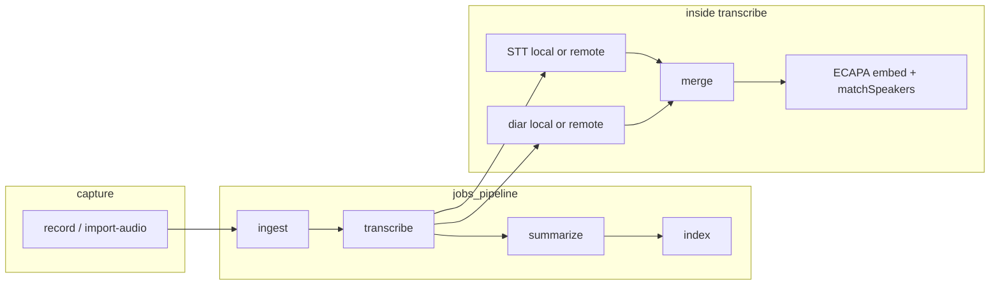
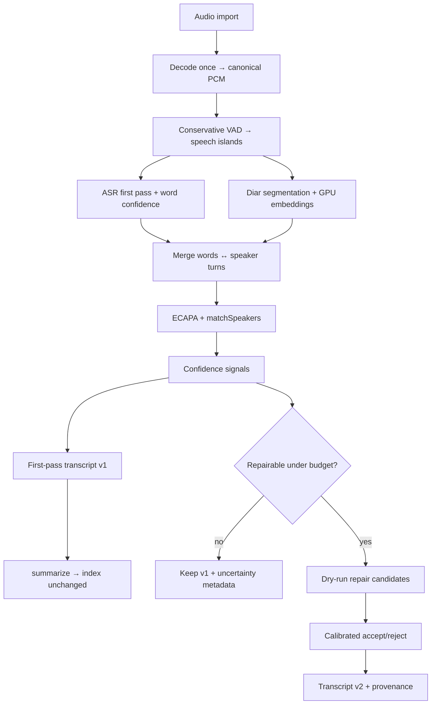

# Speech compute program — design & implementation plan

**Status:** canonical  
**Date:** 2026-06-18  
**Audience:** engineers and agents implementing hosted speech compute, measurement, and gated optimization

> **Agents:** start at **[§0 Agent implementation guide](#0-agent-implementation-guide--start-here)**. Implement phases in order (A7 → A9 → exit → B1 → B2). Ignore stale status fragments outside §0.

This document defines **what we are building**, **what already exists**, **how we measure success**, and **in what order work ships**. It is not a patch list. Every optimization must earn adoption through the measurement system defined here.

### What the redesigned system must achieve

| Layer | Outcome |
| --- | --- |
| **Product** | Fast first-pass transcript + diarization with speaker attribution; optional bounded repair; ECAPA identity stays local by default |
| **Economics** | Beat **$0.0194 / processed audio-hour** on `modal_cuda × batch_queue` at L40S `jobs=10` without quality regression |
| **Accuracy** | Hold WER/DER/cpWER on AMI anchor + protected slices (entity, code-switch, overlap, high-confidence errors) |
| **Observability** | Every run explains **where dollars went** (stage + system waterfall) and **what changed vs prior winner** (`compare.json`) |
| **Agency** | Agents optimize only via `noto bench` → ledger; no adoption from raw Python runs or headline metrics alone |
| **CLI/TUI contract** | `noto import-audio`, `noto record`, `noto modal setup`, job pipeline, and artifact shapes stay stable — GPU work is an **internal implementation** swap, not a new user workflow |

**Primary success** = hosted batch economics + AMI guardrails. **Secondary success** = single-meeting latency (separate MDE) and repair ROI (separate gates after B6). Stretch **~$0.01/hr** is aspirational until VAD proves on real meetings.

**This document optimizes speech compute inside noto's existing product** — record/import → transcribe (STT ∥ diar → merge → ECAPA identity) → summarize → search. It does **not** replace the CLI, change artifact schemas users depend on, or require agents to bypass `notoapi.Client`.

### Reader map

| If you are… | Start here | Then |
| --- | --- | --- |
| **Understanding the product** | **§2.3–§2.4** | §5.3 pipeline; do not break CLI contract |
| **Agent implementing this plan** | **§0 Agent guide** (only section you need first) | §22 schemas; §2.3 product contract |
| **Implementing Program A** | **§0 Phases 1–4** | §14 task IDs; §22 artifacts |
| **Optimizing (agent)** | **§0 Phase 5+**, §16–§17 | §6 hypotheses; §12.15 signatures |
| **Production GPU (B2)** | §9.2, §9.2.1 | §5.2 inventory — bench ≠ prod |
| **Accuracy/repair** | §10, B6–B8 in §14 | §4.6 repair mode gates |
| **Reviewing the plan** | §19 rubric, §21 sanity check | §5.2 exists vs build |
| **Current sprint** | **§0 Implementation status** | §15.1 next tasks |

---

## 0. Agent implementation guide — **START HERE**

**Audience:** an autonomous agent tasked with finishing the GPU redesign.  
**Read this section first.** Other sections are reference; do not scatter across the doc until you need schema detail (§22) or product rules (§2.3–§2.4).

> **Live loop status:** if [GPU_REDESIGN_PROGRESS.md](GPU_REDESIGN_PROGRESS.md) exists, read it first — it
> records what the current implementation loop has already done, the verified ground state, and the next action.

### 0.0 Your mandate

Finish **Program A** (measurement spine + anchor baseline), then **B1 VAD** (first optimization), then **Program B** (production GPU wire). Success means:

1. A ledger **winner** exists for `modal_cuda × batch_queue` with audited `compute_audit.json` + `trace_summary.json`.
2. `noto bench compare` rejects quality regressions (WER/DER/cpWER) — not just cost wins.
3. H1 (VAD) can be tested via `noto bench run --knob vad=on` and adopted only through `ledger append`.
4. Product path (`noto import-audio`) is unchanged until B2 explicitly wires prod Modal.

**North star KPI:** beat **$0.0194 / processed audio-hour** on L40S `jobs=10` without WER/DER/cpWER regression on AMI anchor.

### 0.1 What's already done — do not rebuild

| Done | Location | Verify |
| --- | --- | --- |
| Agent loop (integration) | `platform/bench/runner.go` | `go test ./internal/platform/bench/... -run AgentLoop` |
| `noto bench run` | `modal_runner.go` + CLI | `--integration-only` smoke |
| compare + signatures | `core/bench/compare.go` | `go test ./internal/core/bench/...` |
| ledger append | `ledger.go`, CLI | integration test |
| suite registry | `registry.go` | `noto bench dataset list --json` |
| trace rollup | `trace_summary.go` | `TestGoldenPipeline_TraceSummary` |
| `metrics.json` scoring (A7) | `platform/bench/metrics.go` | `TestRunner_ModalRunCopies…SummaryKPIs` |
| compare quality guardrails (A7) | `core/bench/compare.go` `qualityGuardrails` | `go test ./internal/core/bench/...` |
| `noto bench audit` (A4c) | `runner.go` `AuditRun` + CLI | `TestRunner_AuditRun_TopStagesSorted` |
| agent/hypothesis spend caps (A12) | `platform/bench/spend.go` + `runner.go` | `go test ./internal/platform/bench/... -run Spend` |
| GPU utilization + idle-cost KPI | `trace_summary.go` `gpuUtilization` | `TestBuildTraceSummary_GPUUtilizationIdleCost` |
| `noto bench estimate` (cost + KPI forecast) | `core/bench/estimate.go` + service + CLI | `TestEstimate_AnchorProjectionAndHeadroom` |
| idle-cost surfaced in `compare.json` | `core/bench/compare.go` `gpuCompare`/`gpuInsights` | `TestCompare_SurfacesGPUIdleCostMovement` |
| VAD knob → launcher env fix (`vad`→`BENCH_VAD`) | `modal_runner.go` `knobEnv` | `TestKnobEnv_VADMapsToLauncherVar` |
| gate_ami capped to ~2h (4–5 meeting subsample) | `registry.go` `KnownSuites`/`SuiteAudioHours` | live run scores 5 meetings |
| GPU efficiency KPI on every `bench run` | `modal_runner.go`→service→CLI | busy% + idle-$/audio-hr printed |
| baseline-seed bootstrap (first winner, no compare) | `runner.go` `LedgerAppend`/`hasWinner` | `TestRunner_LedgerAppend_SeedsFirstBaselineWithoutCompare` |
| A9 live anchor winner | `ledger.jsonl` | `noto bench ledger winners` |
| A6a live per-stage diar split | `trace_summary.go` `allocateMeetings` | `TestBuildTraceSummary_DiarSplitFromHypWhenNoStderr` |
| `noto bench retrace` (re-derive trace from stored artifacts, no GPU) | `runner.go` `Retrace` + service/clients/route/CLI | `TestRunner_Retrace_RederivesDiarShareFromStoredHyps` |
| B6 calibration scorers (ECE/Brier/bottom-decile/risk-coverage/high-conf) + admissibility gate | `core/bench/calibration.go` (pure, no I/O) | `calibration_test.go` (10 cases: perfect/random/inverted/guardrail) |
| B6 confidence pipeline wired CPU-end-to-end (align→bridge→transport→score→emit; Modal-gated to populate) | `metrics.AlignHyp`, `platform/bench/calibration.go`, `HypWord/sherpaResult/parakeetResp.Confidence(s)`, `ami_test.go` score, `parakeet_stt_server.py` | `wer_test.go` AlignHyp, `platform/bench/calibration_test.go`, stt `wav_test.go` confidence |
| `noto bench scale` — cost-vs-scale model toward $0.01/audio-hr (fixed-overhead vs marginal-floor split fitted from on-disk runs; says if target is reachable by scale or needs a rate win) | `core/bench/scale.go` (pure), `platform/bench/scale.go` (fit from ledger+summaries), service/client/route/CLI | `scale_test.go` (core + platform), CLI smoke |
| Compare marginal-floor lens — judges a cost lever by whether it lowers the asymptotic $/audio-hr (busy-compute win) vs only trimming idle (fixed overhead); structured `Scale` block + insight, printed in CLI | `core/bench/compare.go` `scaleCompare`/`scaleInsights`, `CompareScale`, notoapi mirror, CLI | `compare_test.go` (floor-moves vs idle-only-trim) |
| Scale-readiness gate — "scale to full anchor only when subsample quality good AND GPU busy ≥70% AND modeled 10h cost ≤ anchor"; surfaced in `noto bench scale` output | `core/bench/scale.go` `EvaluateScaleReadiness`, `QualityWithinCeilings`, `platform/bench/scale.go` reads run trace+metrics, notoapi/service/CLI | `scale_test.go` (all-gates-pass), platform `PopulatesReadinessFromArtifacts`, CLI smoke |

**Live-GPU validated (2026-06-19):** smoke, gate baseline (5 AMI meetings,
WER 20.7 / DER 8.4 / cpWER 27.0), the H1 VAD probe (correctly **rejected** —
+25% cost on dense AMI), and the **full 30-meeting anchor frozen as the ledger
winner** ($0.01633/audio-hr, 82.3% GPU busy). The Go→Python→Modal path produces
real cost, GPU utilization, idle-cost, quality metrics, and per-stage attribution.

**A6a confirmed on the live winner (no GPU):** the anchor run was made by a
pre-fix binary (trace showed `asr` $0.1255 / `diar_emb` $0.00). `noto bench retrace`
re-derived its trace from the stored `hyps/` (each carries the per-meeting diar
wall) → **`diar_emb` $0.1198 (95.4%) / `asr` $0.0060 (4.6%)**, diar dominating as
§5.6 predicts. Headline $/audio-hr and idle headroom are unchanged — only the
stage attribution became honest. `retrace` is the standing cheap-repair path:
any future trace-logic fix applies to historical runs for the cost of file reads.

**Still open:** A8b slice suites (entity/codeswitch/overlap — need datasets);
A8c single-meeting fixtures; Program B execution (B2+ cost levers gated until a B1
lever wins — VAD needs a silence-heavy suite, not AMI). Program A exit criteria
are met. **B6 calibration math is built AND the confidence pipeline is wired
CPU-end-to-end** (`core/bench/calibration.go` scorers + `metrics.AlignHyp`
correctness labels + `platform/bench/calibration.go` bridge + confidence
transport through STT/capture/score + `parakeet_stt_server.py` emission behind
`NOTO_PARAKEET_CONFIDENCE=1`) — the gate the repair system depends on. What
remains for B6 is a **Modal gate-subsample run with confidence enabled** to
populate real word confidence and run the admissibility gate on live data (the
GPU step), then B7 dry-run repair / B8 production behind that gate.

**Cost-vs-scale framing (`noto bench scale`):** a run's cost splits into a per-run
fixed overhead (model load + CUDA init, paid once) and a per-audio-hour marginal
rate, so `$/audio-hr(H) = fixed/H + marginal` falls toward the marginal floor as
audio scales. The tool fits both terms from the on-disk runs and answers whether
$0.01 is reachable by adding audio at all — on the current anchor it is **not**
(the marginal floor sits above $0.01), so the path to $0.01 needs a *rate* win
(utilization/batching/work-reduction), not just more hours. This is the lens the
B-phase cost levers should be judged through: a lever that lowers the marginal
floor is what moves the asymptote; scale only amortizes the fixed overhead.

### 0.2 Workflow — every optimization follows this

```text
1. export NOTO_AGENT_ID=<your-id>
2. noto bench preflight --suite <suite> --tier <tier> --mode batch_queue --json
3. noto bench run       --suite <suite> --tier <tier> --hypothesis H? --knob <one> --json
4. noto bench compare   --baseline <ledger_winner_or_prior_run> --candidate <run_id> --json
5. if decision ∈ {adopt, needs_confirm}: noto bench ledger append --run <run_id> --decision <d> --json
6. noto bench ledger winners --profile modal_cuda --mode batch_queue --json
```

**Rules:**
- One hypothesis + **one knob** per gate-tier run (unless `integration_only` + confirm tier).
- Never `ledger append --decision adopt` without `compare.json` on the candidate run.
- Never cite raw `python scripts/modal_benchmark.py` for adoption — only `noto bench run` artifacts.
- Never route bench through `jobs_pipeline.go`. Never move ECAPA to Modal.

### 0.3 Phase 0 — verify before writing code

```bash
export PATH="$PWD/.tools/go/bin:$PATH"
export NOTO_AGENT_ID=agent-001

go test ./...                                    # must pass before/after every change
go test ./internal/platform/bench/... -run AgentLoop -v

noto bench run --suite smoke@2026-06-18 --tier smoke --integration-only --json
# expect: trace_valid=true, artifacts under ~/.noto/benchmarks/runs/<run_id>/
```

**Build:** `make build` → `./bin/noto bench help`

**Live Modal prerequisites** (Phases 2+): `.venv-modal/bin/python`, `~/.modal.toml`, repo at module root.

---

### 0.4 Phase 1 — **A7: quality metrics** (implement first; no GPU required)

**Why first:** compare already rejects on `guardrails_failed` but nothing populates it yet. Without A7, cost-only adoption is unsafe.

**Goal:** every `bench run` writes scored `metrics.json`; `compare` fills `guardrails_failed` when WER/DER/cpWER regress vs baseline.

| Step | What | Files | Done when |
| ---: | --- | --- | --- |
| 1 | Create scorer facade | `internal/core/bench/metrics.go` (new) | wraps `benchmark/metrics` WER/DER/cpWER funcs |
| 2 | Score hyps after run | `platform/bench/modal_runner.go` or `runner.go` | reads `runs/<id>/hyps/*.json`, AMI refs from `benchmark/e2e/` |
| 3 | Write `metrics.json` | `PersistRun` path | `schema_version: metrics.v1`, `aggregate: {wer, der, cpwer}` |
| 4 | Guardrails in compare | `core/bench/compare.go` | compare sets `guardrails_failed` if delta &gt; §4.1 thresholds |
| 5 | Tests | `core/bench/metrics_test.go`, fixture `testdata/bench/metrics_v1.json` | golden metrics; compare rejects regression |
| 6 | Integration-only path | score from `golden_pipeline/hyp_es2002a.json` | metrics non-empty in integration runs |

**Reference scoring:** `benchmark/e2e/ami_test.go` `TestAMIScore` — same logic, but invoked from Go after run (not a separate `go test` step for agents).

**Guardrail thresholds (§4.1 anchor):** WER ≤ 23.5, DER ≤ 11.3, cpWER ≤ 31.1 on aggregate AMI (tighten with slices in A8b later).

**Verify:**
```bash
go test ./internal/core/bench/... -run Metrics -v
noto bench run --suite smoke@2026-06-18 --tier smoke --integration-only --json
cat ~/.noto/benchmarks/runs/<run_id>/metrics.json   # wer/der/cpwer present
```

---

### 0.5 Phase 2 — **A9: freeze anchor baseline** (needs live Modal GPU)

**Why:** comparisons need a ledger winner at ~$0.0194/hr; MDE needs ≥2 variance runs.

**Goal:** two audited `anchor_ami` runs at `jobs=10`, L40S; adopt the better one to ledger.

| Step | Command / action |
| ---: | --- |
| 1 | `noto bench preflight --suite anchor_ami@2026-06-18 --tier baseline_variance --mode batch_queue --json` |
| 2 | `noto bench run --suite anchor_ami@2026-06-18 --tier baseline_variance --mode batch_queue --json` → `RUN_A` |
| 3 | Repeat step 2 → `RUN_B` (second variance run) |
| 4 | `noto bench compare --baseline $RUN_A --candidate $RUN_B --json` — check cost variance / MDE |
| 5 | Pick lower `cost_per_processed_audio_hour_usd` run as winner |
| 6 | `noto bench compare --baseline <historical_or_RUN_A> --candidate <winner> --json` if needed |
| 7 | `noto bench ledger append --run <winner> --decision adopt --hypothesis baseline --json` |
| 8 | `noto bench ledger winners --profile modal_cuda --mode batch_queue --json` — must list winner |

**Acceptance:** winner `cost_per_processed_audio_hour_usd` ≈ $0.0194 (±variance); `trace_summary.json` `unattributed_pct` &lt; 2%; `metrics.json` passes guardrails.

**If Modal unavailable:** document blocker; continue Phase 1 / 3 code work. Do not fake adopt.

**Optional:** import pre-A6 Python-only runs with `ledger append --historical-unverified` — they **cannot** adopt.

---

### 0.6 Phase 3 — polish Program A (parallelizable after A7)

| ID | Task | Files | Acceptance |
| --- | --- | --- | --- |
| **A4c** | `noto audit show <run_id>` | `ui/cli/commands_audit.go` (new) | prints top-3 stages by $ from `trace_summary.json` |
| **A6a** | STT stderr → `asr` stage | `trace_parse.go`, `parakeet_stt_server.py` stderr hook | `compute_by_stage` includes `asr` on live runs |
| **A12** | Spend caps | `runner.go` | reject run if agent &gt; $5/day or hypothesis &gt; $15/week (§8.4) |
| **A8b** | Slice suites | `registry.go`, `benchmark/e2e/` | `metrics.json` slices: entity, codeswitch, overlap |
| **A8c** | Single-meeting fixtures | `benchmark/dataset/` | 30m/60m cold/warm baselines |

**Verify A4c:**
```bash
noto audit show <run_id> --json   # waterfall + top stages
```

---

### 0.7 Phase 4 — Program A exit (gate before Program B)

All must pass:

```bash
go test ./...

# Live anchor winner
noto bench ledger winners --profile modal_cuda --mode batch_queue --json | jq .

# Quality guardrails on compare
noto bench compare --baseline <winner> --candidate <gate_run> --json | jq '.guardrails_failed, .decision'

# MDE from ≥2 anchor runs (document variance in ledger entry notes)
```

- [x] Agent loop integration test green  
- [x] Ledger winner from **live** Modal anchor (A9) — `modal_cuda × batch_queue`
  frozen 2026-06-19 at **$0.01633 / processed-audio-hr** (20 AMI meetings,
  82.3% GPU busy, WER 0.214 / DER 0.103 / cpWER 0.288, unattributed 0%)  
- [x] `metrics.json` + compare guardrails (A7)  
- [x] `noto bench audit` (A4c)  
- [x] Agent spend caps (A12) — projected on realistic estimate, not tier ceiling  
- [x] GPU utilization + idle-cost KPI threaded into trace + audit + compare + run  

**Program A exit criteria all met (2026-06-19).** Phase 5 (B1 VAD) was probed live
on the gate subsample and **falsified on AMI** (cost +25%, idle worse — dense
corpus, Silero overhead > silence trimmed); needs a silence-heavy suite before
retry. B2 stays gated until a B1 adopt path actually wins.

---

### 0.8 Phase 5 — **B1: VAD optimization** (first real GPU experiment)

**Hypothesis H1** (§6): conservative VAD reduces $/hr without quality regression.

| Step | Action |
| ---: | --- |
| 1 | `noto bench estimate` (optional — implement `commands_bench.go` + service if missing) OR use tier cap from §8.4 |
| 2 | `noto bench run --suite gate_ami@2026-06-18 --tier gate --mode batch_queue --hypothesis H1 --knob vad=on --json` |
| 3 | `noto bench compare --baseline <ledger_winner> --candidate <run_id> --json` |
| 4 | Require: `decision=adopt` or `needs_confirm`, `signature_check.pass=true`, `waterfall_deltas_usd.diar_emb` negative |
| 5 | If `needs_confirm`: auto-run `anchor_ami` confirm tier, then `ledger append` |
| 6 | **Bench only** — VAD knob forwarded via `modal_runner` env (`NOTO_VAD=1`); production `jobs_pipeline` **after** anchor confirm (§9.2) |

**Files:** `scripts/vad_trim.py` (exists), `modal_runner.go` knob env, later `jobs_pipeline.go` behind config flag.

**Reject if:** any `guardrails_failed`, `signature_check` forbidden hit (e.g. win only from `warm_idle`), unattributed &gt; 2%.

---

### 0.9 Phase 6 — **Program B** (after Program A exit)

**Do not start until §0.7 all checked.**

| ID | What | Key files | Exit |
| --- | --- | --- | --- |
| **B2** | Prod Modal wire | §9.2.1 B2.0–B2.7, `computewire`, `jobs_pipeline.go` | `noto import-audio --wait` e2e on remote GPU |
| **B3** | Chunk API | `computewire/computewire.go` | chunk round-trip tests |
| **B4** | Single-meeting latency | `jobs_pipeline.go`, `events.go` | `time_to_first_5_min_merged` MDE |
| **B5** | Batch throughput | `modal_runner.go`, Python servers | $/hr ↓ at jobs=10 |
| **B6–B8** | Calibration + repair | `platform/bench/calibration.go`, repair types | dry-run gates before prod writes |

**B2 invariant:** `SetupModalCompute` stores user-supplied `endpoint_url` — Go never shells out to deploy Modal.

---

### 0.10 Code map & artifacts

```text
internal/core/bench/          # pure: compare, signatures, metrics (A7)
internal/platform/bench/      # I/O: runner, modal_runner, store, ledger
internal/app/service/bench.go
internal/ui/cli/commands_bench.go
scripts/modal_benchmark.py    # GPU subprocess only
~/.noto/benchmarks/
  ledger.jsonl
  runs/<run_id>/
    manifest.json compute_audit.json trace_summary.json metrics.json
    compare.json          # from bench compare
    hyps/*.json             # from Modal run (for A7 scoring)
```

Deep schema reference: **§22**. Product pipeline (do not break): **§2.3–§2.4**, **§5.7**.

### 0.11 Forbidden (instant reject)

- Adopting from raw `modal_benchmark.py` without `noto bench run` artifacts  
- `ledger append --decision adopt` when `historical_unverified=true`  
- Multiple knobs on gate tier without `integration_only`  
- Routing bench through `jobs_pipeline`  
- Moving ECAPA / voiceprints to Modal without explicit opt-in  
- Breaking `transcript.v1`, `summary.v1`, `noto import-audio`, `noto search`  
- Program B before Program A exit (§0.7)  

### 0.12 Implementation status snapshot

**Program A:** ~95% — loop closed and **proven live on Modal L40S** (smoke +
5-meeting gate baseline + H1 VAD probe). A7 (metrics+guardrails), A4c (audit),
A12 (spend caps), GPU idle-cost tracking, `bench estimate`, and idle-cost-in-
compare are done. **A9 (freeze the full 30-meeting anchor to the ledger) is the
only remaining exit blocker** — the path works; it just needs the scale-up run
after VAD is dialed on the subsample (§0.5).  
**Program B:** H1 VAD probed live on the gate subsample (work-reduction lever);
not yet adopted or scaled — correct gating.  
**Agent usability:** this section is the execution contract; trust §0 over older fragments elsewhere in the doc.

---

## 1. North star

noto speech compute must be **quality-gated and cost-accountable** while preserving the **product pipeline** (§2.3): voice → transcript + diarization → local identity → cited summary → search.

1. Run a fast, cheap first pass (inside `transcribe`, not a new job type).
2. Attribute full cost (GPU, CPU, memory, cold start, idle, retries) to every run.
3. Improve **$/processed audio-hour** and latency only when protected quality slices hold.
4. Spend extra compute on repair **only** for spans with positive expected value under budget.
5. Let agents optimize **only** through bounded benchmark runs recorded in an append-only ledger.

**Primary economic target (hosted Modal batch):** beat the audited baseline of **$0.0194 / processed audio-hour** while holding WER, DER, and cpWER on the pinned AMI corpus.

**Cost denominators (always report both after VAD work):**

| Metric | Definition | Use |
| --- | --- | --- |
| `cost_per_processed_audio_hour_usd` | total cost ÷ original audio hours | Headline batch KPI; comparable to baseline |
| `cost_per_speech_hour_usd` | total cost ÷ VAD-retained speech hours | Work-reduction effectiveness |

**Stretch target (not a planning assumption):** approach **$0.01 / processed audio-hour** after conservative work reduction (chiefly VAD) is proven on real meetings — not only on AMI.

**Non-goals:** maximum GPU utilization; bigger GPUs by default; full-meeting ensembles; LLM free-form transcript rewriting; optimizing macOS local GPU throughput.

---

## 2. Scope & execution profiles

One Go control plane serves multiple **execution profiles**. The ledger records which profile ran. Comparisons across profiles are invalid unless explicitly labeled.

| Profile ID | STT / diar stack | Primary use | In scope for cost optimization |
| --- | --- | --- | --- |
| `modal_cuda` | NeMo Parakeet + pyannote community (Python CUDA servers on Modal) | Hosted batch, hosted single meeting | **Yes — primary program** |
| `local_sherpa` | `parakeet-local` (sherpa-onnx with `-tags sherpa`; stub otherwise) + **optional** local diar (not wired in default host) or remote diar when offloaded | Mac/Linux recording, dev, offline | Correctness parity; not $/hr target |
| `cloud_assemblyai` | **Planned / legacy references only** — no STT provider in tree today | Optional cloud offload (future) | Feature matrix only; no NeMo confidence contract |
| `oracle_eval` | Premium / research systems | Quality ceiling measurement | Isolated bench lane |

**Identity embeddings (always separate):** ECAPA-TDNN CPU ONNX (`internal/platform/providers/speaker/`) matches voiceprints across meetings. This stays **local by default** even when speech/diar run on Modal. Diar **GPU embeddings** (pyannote ResNet) are the hosted-batch cost bottleneck — do not conflate the two.

**Bench vs production:** AMI anchor scoring (`TestAMICapture` + `TestAMIScore`) covers STT + diar + merge only — **no ECAPA / SA-WER**. Identity matching runs on the orchestrator after merge in production (`jobs_pipeline.go`). SA-WER guardrails apply when that stage runs (see §4.1). Bench and product stacks also diverge today: bench uses `BENCH_*_ENGINE` CUDA servers; production `ComputeTranscribe`/`ComputeDiarize` do not yet run those engines (§9.2).

**Privacy default:** `SetupModalCompute` routes speech + diar remote, embed local. Any change that ships voiceprints remotely requires an explicit config opt-in and audit field.

### 2.1 Deployment matrix

| Profile | Target | Supported path | Non-goal |
| --- | --- | --- | --- |
| hosted Modal (`modal_cuda`) | production batch + hosted single meetings | Linux x86_64, NVIDIA CUDA, L40S default | long idle GPUs; CPU-heavy boxes |
| private NVIDIA GPU | user-owned server | same Go controller, Python CUDA worker | Modal queue economics |
| macOS / M1 (`local_sherpa`) | recorder, TUI, import | existing local app + optional cloud fallback | SOTA local GPU transcription |
| CPU-only Linux | dev, smoke, fallback | correctness tests | cost/performance target |

CUDA optimization is NVIDIA/Linux-specific. macOS remains important for recording and UX but is not the GPU throughput target.

### 2.2 Feature matrix (what applies where)

| Capability | `modal_cuda` | `local_sherpa` | `cloud_assemblyai` |
| --- | --- | --- | --- |
| $/hr optimization target | **yes** | no | no |
| NeMo word confidence | yes | partial (engine-dependent) | no |
| Repair / confidence graph | after B6–B8 | deferred | disabled |
| VAD work reduction | B1 | optional parity | N/A |
| ECAPA identity matching | local embed | local embed | limited |
| `compute_audit.v1` on jobs | after schema stable | optional | optional |
| Slice guardrails (entity, codeswitch, overlap) | yes | correctness only | partial |

### 2.3 Product pipeline contract (immutable — do not regress)

The GPU/cost program **must preserve** noto's end-to-end meeting flow. Optimization changes **how** stages run (local vs Modal, VAD, batching), not **what** the user and CLI expect.

#### Shipped job pipeline (today)

Every `noto import-audio`, recording stop, or equivalent API call runs the same chained jobs via `runPipeline` in `jobs_pipeline.go`:

```text
ingest → transcribe → summarize → index
```

**`transcribe` is the speech-compute stage** (identity is folded in here, not a separate job type):

```text
audio bytes (local file, always kept for ECAPA)
  ├─ STT  (resolveSTTAdapter → local or remote computewire)
  └─ diar (resolveDiarizer  → local or remote computewire)   # concurrent
        ↓ join
merge words ↔ speaker turns (providers/merge)
        ↓
ECAPA embed per speaker (activeSpeakerEmbedder — CPU ONNX, local)
        ↓
matchSpeakers → persistent profile_id / "Person N" (speakerstore)
        ↓
artifacts.Transcript written to repo (transcript.v1)
```

Downstream (unchanged by this plan's GPU work):

```text
summarize → one LLM call → cited summary.v1 (decisions, actions, risks, questions)
index     → SQLite FTS5 (searchable memory)
```

#### Artifact contract (CLI/TUI/agent-stable)

| Artifact | Schema | Consumer |
| --- | --- | --- |
| Meeting + audio | `meeting.v1`, file on disk | `noto show`, TUI dashboard, `noto play` |
| Transcript | `transcript.v1` — segments, words, speakers, timings | `noto transcript`, TUI detail pane, summarize input |
| Summary | `summary.v1` — cited `segment_id`s | `noto summary`, TUI tabs |
| Search index | FTS5 rows derived from artifacts | `noto search --json` |
| Speaker profiles | SQLite gallery + ECAPA embeddings | People screen, cross-meeting identity |

**Non-regression:** GPU redesign may add optional fields (word confidence, provenance sidecars, `compute_audit` on meetings) but must not break existing JSON shapes or CLI commands.

#### Three compute planes (config presets)

Deployment presets in `config/preset.go` define where work runs — the plan optimizes **remote GPU compute**, not the preset model:

| Preset | Capture | STT + diar | ECAPA identity | Storage/API |
| --- | --- | --- | --- | --- |
| `local` | local | local | local | local |
| `offload-compute` | local | **remote GPU** (`Compute.Endpoint`) | **local** | local |
| `api-server` | local TUI | **remote GPU** (e.g. Modal) | **local** | remote server |
| `remote-backend` | local edge | remote | per config | remote |

**Architectural invariant (from `SetupModalCompute`):** when Modal/offload is configured with `ConfigureRoutes`, **speech + diarize go remote; embed stays local**. Voiceprints do not ship to Modal by default.

#### What this plan may change vs must not

| May change (gated) | Must not change |
| --- | --- |
| STT/diar engines behind `resolveSTTAdapter` / `resolveDiarizer` | Job names: `ingest`, `transcribe`, `summarize`, `index` |
| Internal concurrency (STT ∥ diar, chunk graph B3+) | User entrypoints: `noto record`, `import-audio`, TUI record flow |
| VAD before ASR/diar (B1, feature-flagged) | `notoapi.Client` as sole UI→backend boundary |
| Cost/latency of remote `computewire` POSTs | Artifact kinds consumed by summarize/search |
| Bench path (`noto bench`, `modal_benchmark.py`) | ECAPA matching semantics (cosine, thresholds, review UX) |
| Optional repair transcript v2 (B8) | Summary cite model (`segment_id` evidence) |

### 2.4 Modal & CLI interaction contract

Users and agents interact with Modal through **Go service APIs**, not by running Python scripts for product work.

#### Product Modal surface (exists today)

```text
noto modal status          → GetModalComputeStatus
noto modal setup           → SetupModalCompute (credentials, endpoint URL, GPU class, transfer modes)
                             optional: ConfigureRoutes → speech/diar remote, embed local
noto modal benchmark       → RunModalBenchmark → BenchRun (same path as `noto bench run`)
```

HTTP parity (remote daemon): `/v1/compute/modal/status`, `/setup`, `/benchmark`.

**`SetupModalCompute` deliberately does not shell out to Modal CLI/Python** — the user (or deploy docs) provides `EndpointURL` for a Web Function / `noto serve` GPU box. The backend stores tokens, routing, and policies:

| Config field | Purpose |
| --- | --- |
| `GPU` | Modal GPU class (align to L40S via A10) |
| `UserTransferMode` | `http` \| `temporary` \| `permanent` — how meeting audio reaches GPU |
| `BenchmarkTransferMode` | separate policy for AMI/bench corpora (permanent benchmark volume) |
| `ModelCache` | `volume` \| `image` — weights not re-downloaded per request |
| `ScaledownWindowSeconds` / `MinContainers` | warm-idle economics (trace + B2/B5) |
| `TemporaryThresholdMB` | switch to ephemeral volume for large files |

#### Production audio path (Modal offload)

```text
noto import-audio meeting.wav
  → jobs_worker picks pipeline job
  → runTranscribe reads audio locally (bytes kept for ECAPA)
  → stt/remote + diarize/remote POST raw audio to EndpointURL
       /v1/compute/transcribe  (computewire)
       /v1/compute/diarize
  → merge + ECAPA + matchSpeakers on orchestrator
  → transcript.v1 → summarize → index
```

GPU optimization (VAD, batching, chunk previews) **plugs into this path** — same endpoints, same job progress SSE strings, same final artifacts.

#### Bench Modal surface (measurement only)

```text
noto bench run …           → service → platform/bench/modal_runner.go → scripts/modal_benchmark.py
python scripts/modal_benchmark.py   # subprocess only via noto bench run; never for adoption claims
```

Bench uses **dedicated benchmark transfer** (`BenchmarkTransferMode`, benchmark volume) and does not process user meeting audio. Bench wins promote config/env knobs that the **production** path then inherits (e.g. `NOTO_VAD`, engine names on compute host) — never the reverse.

#### Agent rules for Modal

1. **Product workflows** — always `noto import-audio` / API jobs / `noto modal setup`; never adopt from raw `modal_benchmark.py` alone.
2. **Optimization workflows** — `noto bench` only; compare against ledger; signatures per §12.15.
3. **Do not merge bench runner into `jobs_pipeline`** — A13 shim for `noto modal benchmark` compatibility only.
4. **Preserve embed-local** — any proposal that sends ECAPA embeddings to Modal requires explicit opt-in + audit field (already in `SetupModalCompute` routing).

---

## 3. Current baseline

### 3.1 Hosted batch winner (comparison anchor)

Until superseded by an audited ledger entry, all hosted-batch adoption decisions compare against:

| Field | Value |
| --- | --- |
| Profile | `modal_cuda` |
| Dataset | 30 AMI meetings, 11.44 h processed |
| GPU | L40S, `jobs=10`, 4 CPU cores / 8 GiB RAM |
| WER / DER / cpWER | 23.5 / 11.3 / 31.1 |
| **Cost** | **$0.0194 / processed audio-hour** |
| Utilization | 87% GPU busy (diagnostic only) |
| Peak VRAM | 22.3 GB |
| Stack | `scripts/parakeet_stt_server.py` + `scripts/pyannote_diar_server.py` |
| Source | `BOTTLENECK.md` 20th pass |
| Reproduce (interim) | `python scripts/modal_benchmark.py run --suite ami --profile batch --jobs 10` + local `TestAMIScore` |

**Corpus tiers:** the **anchor** uses the full 30-meeting AMI set (11.44 h). The **`gate_ami@DATE` suite** is a fixed 4–8 meeting stratified subset for cheap gate runs. Gate passes do not adopt defaults alone — they qualify a candidate for `confirm_mixed` or a full-corpus re-run. A gate win that fails on the 30-meeting anchor is **reject**.

**Reference arms (not adoption targets):**

| Arm | $/audio-hr | Notes |
| --- | ---: | --- |
| L4 fallback (`workers=6`) | $0.0208 | Quality-identical; use when L40S capacity tight |
| emb-compile probe | $0.0199 | Quality-neutral; worse at saturation — **rejected** |
| Pre-optimization single-stream L4 | ~$0.61 | Historical; shows why batch + serving work mattered |

### 3.2 Baseline gaps to close before optimization

These are **measurement prerequisites**, not optional polish:

| Gap | Why it blocks adoption |
| --- | --- |
| Ledger-audited `compute_audit.v1` + `trace_summary.json` for anchor | §3.1 numbers are from `BOTTLENECK.md`; cannot adopt from headline alone |
| Cold vs warm single-meeting runs (30 min, 60 min) | Cold idle dominates one-off economics |
| Variance repeats (≥2) on `gate_ami` | MDE unknown until variance measured |
| Bench vs production stack parity documented | `ComputeTranscribe`/`ComputeDiarize` do not yet run `cuda-parakeet-server` / `cuda-pyannote-server` |

### 3.3 Single-meeting latency baseline (to be frozen in Phase 1)

Record before scheduler work:

- `time_to_first_words`
- `time_to_first_5_min_merged`
- `time_to_20pct_merged`
- `time_to_final`
- Full cost split: cold start, model load, warm idle, compute

Historical hint only: warm 38-minute meeting ≈ 26 s wall — **not adoption-grade until audited**.

---

## 4. KPI framework

### 4.1 Hard guardrails (fail = reject)

All must pass on the relevant suite before any adoption. No single headline score overrides these.

| Guardrail | Suite | Threshold | Active |
| --- | --- | --- | --- |
| cpWER regression | `gate_ami` or full AMI anchor | Paired per-meeting Δ; upper 95% CI bound ≤ +0.5 pp | **now** (AMI exists) |
| DER regression | same | Same rule | **now** |
| WER regression | same | Same rule | **now** |
| SA-WER / attribution regression | same | Same rule when identity mapping runs; **exempt `modal_cuda` anchor** until A8d | after A8d |
| Entity/name WER regression | `gate_dev_terms` | Δ ≤ 0 (paired); min 5 clips | after A8b |
| Code-switch WER regression | `gate_codeswitch` | Δ ≤ 0; min 4 clips | after A8b |
| Overlap-region cpWER regression | `gate_overlap` | Δ ≤ 0; min 4 clips | after A8b |
| False insertion rate | `gate_dev_terms` | ≤ 1.0% of reference tokens | after A8b |
| High-confidence error rate | `gate_ami` | Words with confidence ≥ 0.9: error rate must not rise | after B2.6 (confidence populated) |
| Negative repair rate | repair suites | < 0.5% of accepted word edits | after B7 |
| Crash/retry waste | all audited runs | ≤ baseline + 5% relative | **now** |
| Trace overhead (`summary` mode) | all audited runs | < 2% wall time | after A6 |
| Unattributed billed time | all audited runs | < 2%; **>2% → auto-reject** | after A6b |
| Cost estimate drift | Modal runs | \|estimated − billed\| / billed < 10% | after A6 |
| Contention validity | batch changes | Must reproduce at `jobs=10` on L40S | **now** (bench) |

Until an **inactive** guardrail’s suite exists, compare sets `guardrails_skipped: ["gate_codeswitch.wer"]` and blocks **default adoption** — optimization may proceed on active guardrails only; confirm tier requires all **active** gates pass.

**Statistical protocol:** paired per-meeting deltas; bootstrap 95% CI (10k resamples); Holm-Bonferroni across primary metrics (WER, DER, cpWER) at α=0.05. Slice suites use fixed Δ rules until n≥20 clips, then same CI protocol.

**Pareto rule:** cost improvements require all hard guardrails pass. Quality improvements require cost non-regression within +2% on `cost_per_processed_audio_hour_usd`.

### 4.2 Optimization metrics (direction)

| Metric | Mode | Direction |
| --- | --- | --- |
| `cost_per_processed_audio_hour_usd` | `batch_queue` | lower |
| `queue_drain_time_ms` | `batch_queue` | lower |
| `time_to_first_words` | `single_meeting` | lower |
| `time_to_first_5_min_merged` | `single_meeting` | lower |
| `time_to_final` | `single_meeting` | lower |
| WER / DER / cpWER | all | lower |
| Entity/name WER | `gate_dev_terms` | lower |
| Error capture in bottom 10% confidence | calibration | higher |
| Risk-coverage AUC / AUPRC | calibration | higher |
| ECE / Brier (by slice) | calibration | lower |
| Accepted repairs per dollar | `repair` | higher (when enabled) |
| Repair spend as % of speech duration | `repair` | bounded |

**GPU utilization is diagnostic only.** A high-util run that costs more or regresses quality is rejected.

### 4.3 Adoption decision rules

```text
if not comparable(baseline, candidate):
  decision = retry            # max 2 retries; then reject as incomparable
elif dropped_trace_events > 0 and trace_mode != off:
  decision = retry
elif unattributed_billed_pct > 2%:
  decision = reject
elif any hard_guardrail_fails:
  decision = reject
elif improvement < minimum_detectable_effect:
  decision = reject
elif complexity_delta > 2 and not confirm_passed:
  decision = needs_confirm
elif changes_defaults and not confirm_passed:
  decision = needs_confirm
else:
  decision = adopt

# Auto-escalation (runner-enforced, A12):
if decision == needs_confirm and tier allows:
  schedule anchor_ami run within baseline_variance budget
  if anchor passes → decision = adopt; else → reject
```

**Ledger winners:** one winner per `(execution_profile, operating_mode)` tuple, e.g. `modal_cuda × batch_queue`. Supersession requires new audited run + ledger append. **Rollback:** if scheduled regression (§4.5) fails guardrails, prior winner is restored and the failing entry is marked `obsolete`.

**Starting MDE (until A9 variance runs compute it):**

| Change type | Required improvement |
| --- | --- |
| Batch `cost_per_processed_audio_hour_usd` or drain time | ≥ 5% |
| Single-meeting latency (target metric) | ≥ 10% |
| Quality improvement claim | Paired per-meeting win; lower 95% CI bound < 0 |

**MDE after variance:** `MDE = max(5%, 2 × σ_metric)` from ≥2 baseline repeats on the target suite.

### 4.4 Complexity penalty

```text
complexity_delta =
  1 × new_runtime_knob
+ 2 × new_model_artifact
+ 2 × new_long_lived_process
+ 3 × new_external_service_dependency
+ 3 × new_failure_mode_without_recovery
```

Direct adopt requires `complexity_delta ≤ 2` unless confirm suite passes.

### 4.5 Longitudinal accuracy & drift

Bench adoption is not enough. Track quality over time:

| Mechanism | Frequency | Action on failure |
| --- | --- | --- |
| Scheduled `gate_ami` regression vs ledger winner | weekly (manual/scheduled) | Alert; block further adopts until investigated |
| Full 30-meeting AMI anchor re-run | monthly or before default change | Rollback if guardrails fail |
| Production shadow sample (N=5 real meetings/month) | monthly | Feed into slice dashboards; no auto-adopt |
| Calibration snapshot (ECE/Brier by slice) | every audited run | Store in `calibration.json`; trend in ledger |
| User correction proxy (future) | quarterly | Track edit rate on flagged low-confidence spans |

Slice taxonomy (minimum sample sizes): duration bucket, speaker count, overlap %, language, noise class — recorded in `metrics.json` denominators.

### 4.6 Success by operating mode

| Mode | Primary metric | MDE (initial) | Confirm suite | Done means |
| --- | --- | --- | --- | --- |
| `batch_queue` | `cost_per_processed_audio_hour_usd` | ≥ 5% ↓ | `anchor_ami@DATE` | ledger winner + guardrails |
| `single_meeting` | `time_to_first_5_min_merged` | ≥ 10% ↓ | cold+warm 30m/60m fixtures | frozen baseline + guardrails |
| `repair` | net entity/WER delta per repair $ | gate in B7 | dry-run then B8 confirm | no production writes until B7 pass |

Repair adoption (B8): net entity WER improvement with paired CI lower bound &lt; 0; negative repairs &lt; 0.5% of accepted edits; min **2 accepted repairs per $0.01** on gate suite (starting gate, tune after B7 data).

---

## 5. Architecture

### 5.1 Component map

```text
TUI / CLI / HTTP API
        │
        ▼
  app/service          jobs, artifacts, SSE, storage
        │
        ├── jobs_worker + jobs_pipeline   production transcribe path
        ├── bench service methods         benchmark orchestration (new)
        └── modal_compute                 Modal setup + routing config
        │
        ▼
  platform/bench       run store, ledger, modal_runner (new)
  platform/providers   stt, diarize, merge, computewire, speaker
  platform/compute     local ORT EP detection (CUDA/CoreML/CPU)
        │
        ▼
  Python CUDA workers  parakeet_stt_server, pyannote_diar_server, vad_trim
```

**Ownership rules:**

| Concern | Owner | Notes |
| --- | --- | --- |
| Product jobs & artifacts | `app/service` | Never block service goroutine |
| Benchmark orchestration | `app/service` → `platform/bench` | CLI never calls Python directly |
| Pure compare / gates / repair types | `core/bench`, `core/artifacts` | No I/O |
| Run artifacts & ledger | `platform/bench` | Under `ConfigDir/benchmarks/` |
| Local ORT accelerator | `platform/compute/detect.go` | Not Modal GPU class |
| Modal GPU class | `config.ModalComputeConfig.GPU` | L40S default; L4 fallback |
| Remote audio primitives | `computewire` | Raw body; no base64 for STT/diar |
| Diar GPU embeddings | Python pyannote server | Bottleneck |
| Identity embeddings | ECAPA local ONNX | Cross-meeting matching |

### 5.2 Codebase inventory

| Component | Status | Location |
| --- | --- | --- |
| Production pipeline (whole-file STT ∥ diar → merge → ECAPA) | **Partial** | `jobs_pipeline.go` — merge + ECAPA exist; local diar unset in default host; Modal server engines unset |
| Remote STT/diar via HTTP | **Partial** | `computewire`, `stt/remote`, `diarize/remote` — client + routes exist; server half uses `parakeet-local` stub + nil diarizer by default |
| Merge words + turns | **Exists** | `providers/merge` |
| Context bias (speaker names, title) | **Exists** | `contextBiasTerms()` in pipeline |
| Word/speaker confidence fields | **Partial** | `artifacts.Transcript` schema exists; NeMo `parakeet-server` path does not populate word confidence yet |
| Local ORT detection | **Exists** | `platform/compute/detect.go` |
| Modal config + setup CLI | **Exists** | `modal_compute.go`, `noto modal setup` — stores URL/token; does not deploy GPU endpoint |
| Modal runner | **Exists (Go+Python)** | `platform/bench/modal_runner.go` → `scripts/modal_benchmark.py` |
| `RunModalBenchmark` service method | **Done** | delegates to `BenchRun` |
| Bench metrics (WER/DER/cpWER) | **Exists** | `benchmark/metrics/` — not yet wired into `core/bench` compare (A7) |
| Bench run log / LPT scheduling | **Exists (test pkg)** | `benchmark/internal/bench/` — promote patterns only |
| VAD trim (bench diar only) | **Exists** | `scripts/vad_trim.py` — production path has no VAD until B1 |
| E2E baseline gate | **Exists (oracle placeholder)** | `benchmark/e2e/baseline.json` |
| `parakeet-server` internal chunking | **Exists (engine)** | 120 s windows in `parakeet_server.go` — not product streaming API |
| `compute_audit.v1` | **Exists** | `internal/core/artifacts/compute_audit.go` + `testdata/bench/compute_audit_v1.json` |
| `trace_summary.json` / compare logic | **Partial** | `platform/bench/trace_summary.go`, `core/bench/compare.go` — golden/unit tests; no live run yet |
| `noto bench` CLI + ledger | **Partial** | `preflight`, `compare`, `ledger winners` — missing `run`, `append`, `audit` |
| `platform/bench` store + ledger | **Exists** | `store.go`, `ledger.go`, `runner.go` |
| `DefaultModalGPU` L40S | **Exists** | A10 done in `config/defaults.go` |
| Chunked STT/diar API (product) | **Build (later)** | Extend `computewire.go` when B3 starts — distinct from engine-internal 120 s chunks |
| Confidence graph + repair planner | **Build (later)** | After calibration proves signal |
| Partial transcript artifacts | **Build (later)** | Phase 3 product surface |

### 5.3 Processing workflow

#### Shipped today (product — §2.3)



Modal/offload changes **only** the STT and diar boxes (remote `computewire`). ECAPA, merge, summarize, index, CLI, and TUI stay on the orchestrator.

#### Target optimizations (overlay — gated Program B)

VAD, chunk previews, repair, and batch throughput are **internal improvements** to the transcribe stage (and optional post-v1 repair). They do not add new top-level CLI verbs.



Repair writes to production are **disabled** until dry-run beats do-nothing baseline on net WER/entity metrics. **Summarize and index always consume a valid `transcript.v1`** (v1 or v2 with provenance).

### 5.4 Decision boundaries

Evidence-backed decisions vs hypotheses that require gated experiments:

| Category | Decision | Status |
| --- | --- | --- |
| Default GPU | L40S for hosted batch | **settled** — $0.0194/audio-hr at jobs=10 |
| Fallback GPU | L4 when capacity or smaller VRAM matters | **settled** — quality-identical; $0.0208/audio-hr |
| First optimization | conservative VAD / work reduction | **settled priority** — highest-confidence cost lever |
| Control plane | Go owns budgets, audit, artifacts, product decisions | **architectural** |
| CUDA plane | Python owns NeMo/pyannote/Torch experiments | **ecosystem** |
| Identity embeddings | ECAPA stays local by default | **privacy architectural** |
| Repair writes | dry-run first; production only after calibration | **hypothesis** (B7→B8) |
| Context biasing | repair-only until false insertions measured | **hypothesis** (H8) |
| Alternate ASR | repair/oracle path, not default ensemble | **hypothesis** (H9) |
| Code-switch repair | required slice; method not proven | **hypothesis** — suite A8b |
| Source separation / GSS | oracle/confirm only | **high-cost hypothesis** (H10) |
| TensorRT / static embeddings | research lane | **rejected** at saturation (H3) |
| Bigger GPUs (A100/H100) | not default | **rejected** (H4) |

### 5.5 Operating modes

Scale by queued **audio seconds** and queue age, not request count.

| Mode | Use case | Objective | Default policy |
| --- | --- | --- | --- |
| `single_meeting` | user stops recording and waits | first useful artifact quickly | start on warm GPU or spin up only when faster than fallback |
| `batch_queue` | hosted backlog | lowest quality-gated $/processed audio-hour | brief queue for compatible batches; drain on one L40S first |
| `repair` | improve usable transcript | high-value correction under budget | only after first pass; only repairable spans |
| `oracle_eval` | measure quality ceiling | compare premium systems | isolated bench path; never default production |

### 5.6 Measured engineering conclusions

From `BOTTLENECK.md` (do not re-litigate without new evidence):

- STT batching is **not** the main bottleneck at saturation.
- **Diarization GPU embedding compute** is the main remaining GPU cost.
- More serving topology work unlikely to help without **reducing work** (fewer audio-seconds).
- **VAD** is the highest-confidence next cost lever — reduces seconds fed to ASR/diar.
- **emb-compile / TensorRT fusion** is quality-neutral but throughput-neutral-to-negative at saturation — rejected.
- **L4 vs L40S** settled: L40S wins on $/hr; L4 is capacity fallback only.
- **CPU and memory bill separately** on Modal — fat CPU containers erase GPU savings.
- **Contention matters:** small uncontended gate runs cannot adopt throughput changes.

### 5.7 CLI, TUI, and agent non-regression checklist

Before any GPU optimization ships to production, verify:

| Check | Command / surface |
| --- | --- |
| Import still runs full pipeline | `noto import-audio <file> --wait` |
| Transcript artifact valid | `noto transcript <id> --json` → `transcript.v1` |
| Summary cites segments | `noto summary <id>` → `segment_id` refs |
| Search works | `noto search "…" --json` |
| Modal setup routes remote STT/diar, local embed | `noto modal status` → speech/diar remote, embed local |
| Offload preset intact | `offload-compute` / `api-server` presets in `config/preset.go` |
| TUI topology reflects planes | TUI compute topology (local vs remote pills) |
| Agent API unchanged | `noto list --json`, `noto show --json` shapes stable |
| Bench does not become product path | `noto bench` never required for normal import |

Program A (`noto bench`) is **parallel infrastructure** for measurement — it must not become a prerequisite for `import-audio` or recording.

---

## 6. Hypothesis registry

Decisions are either **settled** (implement) or **gated** (experiment before spend). Gated hypotheses have a max budget tier and falsification criterion.

| ID | Hypothesis | Status | Max budget | Falsified if |
| --- | --- | --- | --- | --- |
| H0 | Measurement spine enables safe optimization | **settled** | preflight $0 | N/A — build first |
| H1 | Conservative VAD reduces $/hr without quality regression | **gated — highest priority** | gate $1.50 | Any guardrail fails or cost improvement &lt; 3% at gate tier |
| H2 | L40S beats L4 on $/hr at target contention | **settled** | — | L4 already measured worse ($0.0208) |
| H3 | emb-compile / TensorRT fusion reduces $/hr at saturation | **rejected** | smoke only | 20th pass: neutral-to-negative |
| H4 | Bigger GPU (A100/H100) improves $/hr | **rejected** | — | Dominated on Modal menu for this shape |
| H5 | Preview/steady chunking improves single-meeting latency | **gated** | gate $1.50 | Latency win < MDE or quality regression |
| H6 | Frame/window batching improves batch $/hr | **gated** | gate $1.50 | Win disappears at target contention |
| H7 | NeMo word confidence predicts errors for repair ranking | **gated** | gate $1.50 | Bottom decile not better than random |
| H8 | Context-biased re-decode improves entities without false insertions | **gated** | confirm $5 | False insertion rate rises |
| H9 | Alternate ASR as repair span pass beats cost of full second pass | **gated** | confirm $5 | $/hr exceeds repair budget envelope |
| H10 | Source separation / GSS helps overlap slice | **gated — oracle only** | confirm $5 | Overlap cpWER flat; cost >> baseline |
| H11 | LLM constrained ranker beats alignment-only ranking | **gated** | confirm $5 | No net entity gain; $ blowout |

**Cost explosion guard:**

- No gated hypothesis above its tier without ledger entry.
- Bundled knob changes rejected unless `integration-only` + confirm tier.
- **Cumulative caps:** ≤ $5/agent/day on gate+confirm tiers; ≤ $15/week per hypothesis ID across retries.
- Direct invocation of `modal_benchmark.py` bypasses enforcement — **forbidden for adoption claims**; only `noto bench run` artifacts count.

---

## 7. Vocabulary & mappings

Three independent axes — never conflate:

| Axis | Field | Values | Example |
| --- | --- | --- | --- |
| Execution profile | `execution_profile` | `modal_cuda`, `local_sherpa`, `cloud_assemblyai`, `oracle_eval` | Which STT/diar stack |
| Operating mode | `operating_mode` | `batch_queue`, `single_meeting`, `repair`, `oracle_eval` | Scheduling objective |
| Concurrency profile | `concurrency_profile` | `prod`, `batch`, `fast` | Maps to Python `--profile` |

**Suite ID → runner mapping:**

| Suite ID | Python `--suite` | Notes |
| --- | --- | --- |
| `smoke@DATE` | `synthetic` | 2–4 clips |
| `gate_ami@DATE` | `ami` (subset manifest) | 4–8 meetings from AMI pool |
| `anchor_ami@DATE` | `ami` (full) | All 30 meetings; confirm/adoption |
| `confirm_mixed@DATE` | `ami` + extensions | Holdout; not tunable |

Legacy `noto modal benchmark --suite e2e` → `noto bench run --suite smoke@DATE`.

---

## 8. Measurement system (Program A)

Program A ships **before** any scheduler, VAD production, or repair work. No Program B work until Program A exit criteria pass.

**`modal_runner.go` design:** `platform/bench/modal_runner.go` invokes `scripts/modal_benchmark.py` as a **subprocess** from the service layer only. CLI calls service → runner → Python. Runner maps `summary.json` → `compute_audit.v1` + writes run store. Python remains executor; Go owns validation, compare, and ledger.

**Field mapping (today → target):**

| `compute_audit.v1` | Current producer |
| --- | --- |
| `cost.*`, `total_wall_ms` | `modal_benchmark.py` `summary.json` |
| `git_*`, `dataset_version` | Go runner (new) |
| `cost_waterfall`, `compute_by_stage` | **A6b** — Go rollup from summary + pyannote stderr |
| `diar_emb` / `vad` stage ms | pyannote stderr `stages_ms`, `vad_kept` → **A6a** parser |
| `stages[]`, `cold_start_ms`, `warm_idle_ms` | `.docs/benchmarks.md` spec + **A6** runner |
| `compare.json` waterfall deltas | **A4b** `core/bench/compare.go` |
| WER/DER/cpWER | `benchmark/metrics` after `TestAMIScore` |
| `execution_profile` | Go runner constant `modal_cuda` |

**Field aliases (normalize on ingest):**

| Legacy / Python | Canonical |
| --- | --- |
| `summary.cost_per_audio_hour_usd` | `cost_per_processed_audio_hour_usd` |
| Python `--profile batch` | `concurrency_profile=batch`; `operating_mode=batch_queue` |
| `summary.duration_ms` | `total_wall_ms` |

Canonical schemas live in §22; validation tests in `internal/core/bench/schema_test.go` and `testdata/bench/*.json`.

### 8.1 Artifacts per run

```text
ConfigDir/benchmarks/runs/<run_id>/
  manifest.json           # bench_run_manifest.v1
  compute_audit.json      # compute_audit.v1
  metrics.json            # aggregate + slice metrics
  compare.json            # paired deltas vs baseline
  trace_summary.json      # stage/batch cost attribution
  calibration.json        # when applicable
  ledger_entry.json       # proposed decision record
```

Append-only index: `ConfigDir/benchmarks/ledger.jsonl`

### 8.2 `compute_audit.v1` (required fields)

Top-level run record. Stage detail lives in `trace_summary.json` (rollup) and optionally `trace_events.jsonl` (experiment/profile).

**Scalars:** `run_id`, `execution_profile`, `operating_mode`, `git_commit`, `git_dirty`, `dataset_version`, `split_id`, `hardware` (gpu, cpu_cores, memory_gib), `model_versions[]`, `modal_image_id`, `cache_state`, `total_audio_sec`, `total_speech_sec`, `total_wall_ms`.

**Cost:** `cost` object with `gpu_seconds`, `cpu_core_seconds`, `memory_gib_seconds`, rates, `estimated_cost_usd`, `billed_usd` (when reconciled), `cost_per_processed_audio_hour_usd`, `cost_per_speech_hour_usd`.

**Overhead buckets:** `cold_start_ms`, `model_load_ms`, `warm_idle_ms`, `audio_stage_ms`, `retry_ms`, `crash_billed_ms`, `cancel_billed_ms`, `trace_overhead_pct`, `unattributed_usd`, `unattributed_pct`.

**Nested (summary pointers):** `stages[]` (top-N by cost), `batches[]` (counts + mean padding_waste), `quality_gates[]`, `latency_milestones`, `trace_summary_ref` (path or embedded hash).

**Canonical ownership:** `trace_summary.json` is the **source of truth** for stage/system cost attribution and per-meeting rollups. `compute_audit.v1` carries headline scalars + pointers (`trace_summary_ref`); it must not duplicate full `compute_by_stage` arrays. `trace_events.jsonl` is optional detail for experiment/profile modes only.

**`stages[]` element:**

```text
stage_id          # canonical ID from §12.8
system            # stt_server | diar_server | go_pipeline | …
wall_ms
billed_gpu_ms
billed_cpu_core_ms
estimated_usd
pct_of_total
counters          # e.g. speech_sec, windows, batches, oom_retry
```

### 8.3 Benchmark suites

| Suite ID | Size | Purpose | Tunable by agents |
| --- | --- | --- | --- |
| `smoke` | 2–4 clips | Crash, schema, obvious regression | yes |
| `gate_ami` | 4–8 AMI meetings | WER/DER/cpWER + $/hr | yes |
| `gate_dev_terms` | short product clips | Entity WER, false insertions | yes |
| `gate_codeswitch` | EN/DE clips | Code-switch WER | yes |
| `gate_overlap` | labeled overlap | Overlap cpWER | yes |
| `confirm_mixed` | 20–30 meetings | Default-change acceptance | **no — holdout** |

Suite IDs are immutable (`suite@YYYY-MM-DD`). Synthetic audio is protocol stress only unless references validated for STT quality claims.

### 8.4 Budget tiers

| Tier | Max USD | Use |
| --- | ---: | --- |
| preflight | $0.00 | Validate config, IDs, expected cost |
| smoke | $0.25 | Protocol / crash |
| gate | $1.50 | Quality + cost comparison |
| confirm | $5.00 | Default-change only |
| baseline_variance | $15.00 | Repeated baseline for MDE (manual/scheduled) |
| integration-only | $5.00 | Multi-knob or bundled scheduler changes — **confirm tier only**; never direct adopt from gate |

Runner stops before projected spend exceeds tier cap. Killed runs record partial cost as failed experiments.

**Agent spend caps** (cumulative, ledger-enforced): `$5/agent_id/day`, `$15/hypothesis_id/week`. See §22.3 for `agent_id`.

### 8.5 CLI surface

```text
noto bench estimate|preflight|run|compare|calibrate|ablate|dataset|repair|ledger ...
noto audit show|trace ...
```

`noto modal benchmark` → thin wrapper over `noto bench run` (**shipped**). `RunModalBenchmark` calls `BenchRun` directly.

### 8.6 Comparability refusal

`bench compare` rejects incompatible runs unless explicit override with recorded reason. Incompatible when differing: `execution_profile`, dataset/split, operating mode, model hash, GPU/CPU/RAM shape, target concurrency, cache state (cold/warm sensitive), trace mode, benchmark code version, `bench_stack` tag (see A6d).

#### 8.6.1 Comparability manifest checklist

Required in `bench_run_manifest.v1.comparability` and validated at preflight:

| Field | Type | Incomparable when |
| --- | --- | --- |
| `execution_profile` | string | differs |
| `operating_mode` | string | differs |
| `suite_id` / `split_id` | string | differs (unless explicit holdout override) |
| `target_concurrency` | int | differs for batch throughput claims |
| `cache_state` | enum | differs on cold/warm sensitive metrics |
| `trace_mode` | enum | differs when trace gates apply |
| `hardware.gpu` | string | differs |
| `hardware.cpu_cores` / `memory_gib` | int | differs |
| `model_versions[]` hash | string | differs |
| `git_commit` | string | differs unless `allow_code_drift` on confirm |
| `bench_stack` | string | `bench_cuda` vs `prod_compute` (A6d) |

Machine-readable `incomparable_reason` codes: `profile_mismatch`, `mode_mismatch`, `dataset_mismatch`, `concurrency_mismatch`, `cache_mismatch`, `hardware_mismatch`, `model_mismatch`, `trace_mismatch`, `bench_stack_mismatch`, `knob_bundle_on_gate`.

### 8.7 CI & hardware matrix

| Tier | Where | What |
| --- | --- | --- |
| Unit | GitHub CI | Schema validation, compare logic, ledger append, fixture audits |
| Integration | `-tags=integration`, CPU | Local sherpa smoke, merge/metrics chain |
| Bench smoke | Manual / scheduled | Modal **L4** (`smoke` suite — cheap) |
| Adoption gate | Manual / scheduled | Modal **L40S** (`gate_ami` at `jobs=10`) |

CI cannot enforce GPU adoption gates today; scheduled workflow or manual gate is required for default changes.

---

## 9. Optimization program (Program B)

Program B starts only after Program A acceptance and audited baseline freeze.

**Scope boundary:** Program B optimizes **speech compute inside §2.3** — STT, diar, merge timing, optional repair — without new CLI verbs, without moving ECAPA off-device, and without changing summarize/index contracts. Chunk previews (B3–B4) add **earlier transcript visibility** via the same `transcribe` job + SSE progress, not a separate product surface.

### 9.1 Phase B1 — Work reduction (highest-confidence)

**Hypothesis H1:** conservative Silero VAD (`scripts/vad_trim.py`, already in bench diar path) reduces seconds into ASR/diar without clipping speech.

- Promote VAD from bench to orchestrated path (feature-gated).
- Preserve padding; map timestamps back to original audio.
- Gate on all hard guardrails + ≥ 5% $/hr or drain-time improvement.

Expected range from `BOTTLENECK.md`: ~1.2× on AMI; higher on silence-heavy real meetings.

**B1 production promotion:** bench adopt on `gate_ami` + H1 signature → `needs_confirm` → `anchor_ami` auto-run → ledger adopt enables `NOTO_VAD=1` in runner only. Production `jobs_pipeline` VAD behind `config` feature flag until anchor passes. No default-on in product until anchor confirm.

### 9.2 Phase B2 — Production Modal wiring

**Two paths — do not conflate:**

| Path | Purpose | Entry |
| --- | --- | --- |
| **Bench** | measurement + optimization | `platform/bench/modal_runner.go` → `scripts/modal_benchmark.py` |
| **Production** | real user jobs | `SetupModalCompute` → `jobs_pipeline` → remote `computewire` → GPU host `noto serve` |

Wire production `modal_cuda` via deployment presets (`offload-compute`, `api-server`) per **§2.4**:

1. **Deploy** documented GPU compute endpoint (Modal Web Function or private GPU running `noto serve` with `/v1/compute/*`) — B2.0. User supplies URL via `noto modal setup --endpoint-url` (no shell-out from Go).
2. **Compute server engines:** `/v1/compute/transcribe` and `/v1/compute/diarize` use `LocalSTT`/`LocalDiarizer` backed by `cuda-parakeet-server` and `cuda-pyannote-server` from config — not `parakeet-local` stub — B2.1.
3. **Orchestrator:** `resolveSTTAdapter` + `resolveDiarizer` → remote HTTP when `execution_profile=modal_cuda` — B2.2.
4. Align `DefaultModalGPU` to L40S (A10).
5. **Admission:** link `jobs_worker` pool (4 concurrent) to GPU capacity + compute-side admission — avoid VRAM thrash and 4× cold subprocesses — B2.5.
6. **Warm policy:** `NOTO_MODEL_KEEP_WARM` on long-lived GPU hosts; document scaledown per mode — B2.4.
7. **OOM policy:** retry smaller batch / fewer workers; record `oom_retry` in audit; fatal CUDA → process restart (pyannote server).
8. **E2E acceptance:** import audio → remote transcribe job → artifacts + `compute_audit.v1` — not `TestAMICapture` alone — B2.6.
9. **Limits:** document/enforce max meeting duration or streaming plan for whole-file POST (`os.ReadFile` today) — B2.7.

`RunModalBenchmark` → `BenchRun` only — **never** route bench through `jobs_pipeline`.

#### 9.2.1 B2 subtasks

| ID | Task | Depends | Evidence |
| --- | --- | --- | --- |
| B2.0 | GPU compute endpoint deploy artifact | A10 | reachable `/v1/compute/*` on L40S |
| B2.1 | Server engine registry on compute host | B2.0 | `cuda-parakeet-server` + `cuda-pyannote-server` active |
| B2.2 | Config/env: `speech_engine`, `diar_engine` on compute host | B2.1 | documented `NOTO_*` or config fields |
| B2.3 | Lazy `activeDiarizer()` for local sherpa/pyannote (`local_sherpa`) | — | local diar works without injection |
| B2.4 | `NOTO_MODEL_KEEP_WARM` + scaledown policy doc | B2.0 | warm repeat faster than cold on 30m fixture |
| B2.5 | Compute-side admission + `NOTO_VAD` on production pyannote path | B1 or parallel | VAD on compute backend mirrors bench |
| B2.6 | NeMo per-word confidence in `parakeet-server` → `artifacts.Word` | B2.1 | confidence populated on compute path — **emission code built** (`NOTO_PARAKEET_CONFIDENCE=1`, entropy/min-aggregation), transport wired to `HypWord`/`EngineWord`; pending a Modal run to validate it populates |
| B2.7 | Whole-file limits / streaming policy | B2.6 | documented max duration or B3 chunk path |

### 9.3 Phase B3 — Chunk graph & APIs (shared foundation)

Before single-meeting latency or advanced batching:

**Product chunk contract** (extends `computewire.go`):

```http
POST /v1/compute/transcribe/chunk
Content-Type: application/octet-stream
X-Noto-Sequence-Id: <uuid>
X-Noto-Offset-Ms: <int>
X-Noto-Is-Final: true|false
X-Noto-Meeting-Id: <id>
```

Response `200`:

```json
{
  "sequence_id": "uuid",
  "offset_ms": 0,
  "is_final": false,
  "words": [{"text": "...", "start_ms": 0, "end_ms": 120, "confidence": 0.91}],
  "partial": true
}
```

Errors: `409 sequence_gap` (missing offset), `413 chunk_too_large`, `422 invalid_offset`.

**Distinction:** `parakeet-server` already chunks at **120 s internally** for whole-file requests — that is engine-internal, not this API. B3 adds **product-visible** partials for single-meeting mode.

- Shared work units: `decode_block`, `vad_block`, `asr_chunk`, `emb_window_batch`, `merge_slice`.
- Partial merge slices; **no repair budget before first artifact**.

Depends on B2.

### 9.4 Phase B4 — Single-meeting lane

- Preview ASR chunks (20–45 s) then steady (60–120 s).
- Interleave diar so merge not blocked by full-meeting diar.
- Publish first artifact at 5–8 min merged or 20% merged.
- Product blast radius: SSE events, partial repo saves, search reindex policy, TUI refresh.

Depends on B3. Hypothesis H5.

### 9.5 Phase B5 — Batch throughput lane

- Batch ASR by model + language + duration bucket.
- Batch diar embeddings densely; track `padding_waste`.
- Queue waits: `single_meeting` ASR 0–25 ms, diar 0–50 ms (§11.3); `batch_queue` ASR 100–500 ms, diar 100–1000 ms.
- Gate at **target contention** (`jobs=10` on L40S).

Depends on B3. Hypothesis H6.

### 9.6 Phase B6 — Confidence & calibration

Extract: ASR word confidence, diar confidence, language confidence, overlap risk, boundary conflict.

Build calibration reports by slice; beat do-nothing and random-span baselines on error detection.

**Calibration math implemented** (`internal/core/bench/calibration.go`, pure / no I/O):
`ECE`, `Brier`, `BottomDecileCapture`, `RiskCoverageAUC`, `HighConfidenceErrorRate`,
`BuildCalibrationReport` → `calibration.v1`, and `EvaluateCalibrationGate` (the
admissibility decision — bottom-decile capture must beat the random/do-nothing
baseline `BottomDecileFraction` and not breach the high-confidence-error guardrail).

**Confidence pipeline wired end-to-end (CPU prep; Modal validation pending).** The
word-confidence path now exists in code, dormant until a Modal run populates it:

- **Correctness labels** — `metrics.AlignHyp(ref, hyp)` returns one match/error
  label per hyp word from the SAME edit-distance backtrace as WER, so labels are
  exact and consistent with the reported WER split (`benchmark/metrics/wer.go`).
- **Bridge** — `platform/bench/calibration.go`: `BuildWordConfidences` aligns a
  meeting's hyp words to its reference and attaches each word's confidence →
  `[]corebench.WordConfidence`; `Runner.WriteCalibration` persists `calibration.json`
  only when confident words exist (no fabricated artifact for a no-confidence run).
- **Confidence transport** — `HypWord.Confidence *float64` (capture wire),
  `sherpaResult.Confidences`/`parakeetResp.Confidences` → `EngineWord.Confidence`
  (a word takes its weakest subword's confidence), preserved through `merge.Attribute`.
- **Score wiring** — `benchmark/e2e/ami_test.go` `TestAMIScore` collects word
  confidences across meetings, writes `calibration.json` at the run root, and logs
  the admissibility gate (capture vs baseline, high-conf error rate).
- **Emission** — `parakeet_stt_server.py` emits per-word confidence behind
  `NOTO_PARAKEET_CONFIDENCE=1` (NeMo entropy measure, per-word min aggregation);
  the default validated decode path is byte-identical, and a NeMo version without
  the confidence API degrades to emitting none rather than crashing.

Remaining for B6: a Modal gate-subsample run with `NOTO_PARAKEET_CONFIDENCE=1` to
populate real confidence and run the admissibility gate on live data — the GPU step.

Depends on audited baseline. Hypothesis H7. **No production repair until this passes.**

### 9.7 Phase B7 — Dry-run repair

- Repairability filters + expected-value ranking in `core/bench/repair.go`.
- Emit candidates only; record provenance, cost, benchmark GT delta.
- `noto bench repair dry-run`.
- Budget: 5–15% of speech duration (cap 5–10 min) when enabled.

Depends on B6. Hypotheses H8–H11.

### 9.8 Phase B8 — Guarded repair writes

- Transcript versioning / provenance sidecar.
- Production replacement only for methods passing dry-run gates.
- Rollback to first-pass version.

Depends on B7 acceptance.

---

## 10. Accuracy, repair & confidence system

This section defines **how we push accuracy forward without exploding compute cost**. Cost wins that regress protected quality slices are rejected. Accuracy work that cannot be measured, budgeted, and traced is deferred.

### 10.1 Protected quality slices

Accuracy is not one number. The system optimizes toward:

| Slice | Why it matters | Suite |
| --- | --- | --- |
| Word accuracy (WER) | Core transcript fidelity | `gate_ami`, anchor |
| Speaker boundaries (DER) | Who spoke when | `gate_ami`, anchor |
| Speaker-attributed words (cpWER) | Action owners, attribution | `gate_ami`, anchor |
| Speaker assignment (SA-WER) | Identity mapping quality | anchor when ECAPA runs |
| Entity / name / API terms | Product and repo vocabulary | `gate_dev_terms` |
| English/German code-switching | Mixed meetings; no false Anglicization | `gate_codeswitch` |
| Overlap regions (cpWER) | Concurrent speech; partly unrecoverable without separation | `gate_overlap` |
| High-confidence errors | Trust in displayed confidence | all audited runs |
| False insertions | Repair and biasing must not invent terms | `gate_dev_terms` |

**Overlap-region cpWER** is a protected diagnostic, not the global decision anchor — single-channel overlap may be unrecoverable without separation or target-speaker ASR.

### 10.2 Confidence graph (target)

After first-pass merge, combine signals into a per-word / per-span risk model:

| Signal | Source | Use |
| --- | --- | --- |
| ASR word confidence + entropy | NeMo (`modal_cuda`) | Error likelihood |
| Timestamp instability | Re-decode variance | Repairability |
| Language confidence | ASR / span detector | Code-switch handling |
| Glossary / entity proximity | Context memory + meeting metadata | Entity risk |
| Diar boundary conflict | pyannote vs merge | cpWER risk |
| Overlap risk | diar + energy heuristics | Overlap slice |
| Summary / action relevance | downstream NLP (optional) | Value weighting |
| Historical confusion | ledger + user edits | Prior error patterns |

**Program B6** must prove bottom-decile / high-risk bins capture real errors better than random and do-nothing baselines before repair uses confidence for spend decisions.

### 10.3 Confidence calibration contract

Calibration is useful only if it predicts errors on slices users care about. Every calibration report includes:

- word-level calibration by language, speaker count, overlap, noise, entity terms, meeting duration;
- separate deletion, substitution, insertion risk where references allow;
- alignment checks after transcript normalization and timestamp repair;
- high-confidence error rate (especially words above 0.9 confidence);
- selective risk curves: WER / entity WER as uncertain spans are removed or repaired;
- do-nothing, random-span, and raw-confidence baselines.

**Repair adoption cannot be based on confidence improvement alone.** Text quality, speaker attribution, entity accuracy, and negative repairs decide whether the confidence model is useful.

### 10.4 Repairability scoring

Only spans with positive **expected value** enter repair. Hard eligibility first; then rank.

```text
hard eligibility:
  span is not already high-confidence
  span is high-value or high-risk
  method is allowed in this operating profile
  budget remains for this meeting/run
  required context exists

rank:
  expected_value =
    P(error)
    × P(repair_success | method, span, context)
    × product_value
    - expected_compute_cost
    - negative_repair_risk
    - complexity_penalty
```

This avoids suppressing valuable spans because one signal is missing, and avoids agents tuning weights to pass a small gate.

**First shipped form: dry-run repair only** — record candidates, provenance, cost, and benchmark ground-truth deltas; **do not** replace transcript text in production until calibration, negative-repair, and slice gates pass.

### 10.5 Repair methods

| Method | Default status | Reason |
| --- | --- | --- |
| same-model alternate decode | allowed after calibration | cheap first repair |
| context-biased re-decode | repair-only first | false insertion risk (H8) |
| forced alignment against candidates | experiment | candidate ranking |
| alternate ASR model | experiment | independence vs hidden ensemble cost (H9) |
| boundary reassignment | dry-run first | local merge tweaks recover little unless boundary error clear |
| diar reclustering | oracle/confirm only | global side effects |
| source separation / GSS | oracle/confirm only | expensive, data-dependent (H10) |
| constrained LLM correction | candidate ranker only | never free-write transcript text (H11) |

Extend existing `contextBiasTerms()` in `jobs_pipeline.go` for biasing — do not duplicate with a parallel hardcoded rules engine.

### 10.6 Repair budget

```text
repair_budget_sec = min(speech_sec × repair_ratio, repair_budget_cap_sec)
repair_budget_usd  = min(remaining_run_budget, profile_cap)   # dollar guard for LLM/API paths
```

Starting values:

- normal: 5–15% of speech duration;
- high-quality profile: 15–30%;
- cap: 5–10 minutes unless user explicitly requests more.

Every repair report includes: candidate span seconds, attempted seconds, accepted seconds, skipped high-value seconds (budget), accepted repairs per dollar, negative repair counts by word / entity / speaker / language / timestamp.

**Repair budget before first artifact is zero** in `single_meeting` mode.

### 10.7 Code-switching

English/German mixed meetings require span-level handling:

- detect language by span, not only per meeting;
- keep mixed-language words — do not normalize German technical terms into plausible English;
- use language confidence in repairability;
- track code-switch WER separately;
- reject repairs that "correct" German terms into English false friends.

### 10.8 Context memory (target schema)

Recurring correction evidence — retrieval/bias input, not hardcoded rules:

```text
term_memory
  surface_form
  aliases / common wrong forms
  source: user_edit | benchmark | glossary | confirmed_repair
  language
  confidence
  false_insertions
  last_seen
```

Ship after dry-run repair proves value; layer on `contextBiasTerms` and glossary config.

### 10.9 Constrained optimization reward

Do not use a single `quality / cost` headline score. **Adoption decisions use §4.3 only** — this section describes diagnostic reward for ranking candidates during exploration, not ledger adopt/reject.

```text
if hard_guardrails_fail:
  decision = reject
elif improvement < minimum_detectable_effect:
  decision = reject
elif run_is_not_comparable:
  decision = retry
else:
  reward =
    quality_gain_points × quality_weight
    + latency_gain_pct × latency_weight
    + cost_gain_pct × cost_weight
    - repair_compute_pct × repair_penalty
    - complexity_penalty
```

Report paired per-meeting deltas, win/loss/tie counts, confidence intervals, and slice denominators on every compare.

---

## 11. Scheduling & batch design

### 11.1 Work units

The work unit is not a meeting; it is a graph of blocks, chunks, windows, batches, and repair spans.

| Unit | Typical size | Runs on | Output |
| --- | --- | --- | --- |
| `decode_block` | 30–120 s | CPU | PCM block |
| `vad_block` | 30–120 s | CPU ONNX | speech islands |
| `asr_chunk` | 20–45 s preview; 60–120 s steady | GPU | words + confidence |
| `seg_window` | diar window | GPU | speaker activity |
| `emb_window_batch` | many speech windows | GPU | embeddings (**main bottleneck**) |
| `merge_slice` | 30–120 s | CPU | word–speaker assignment |
| `repair_span` | 5–30 s | GPU/API/LLM | candidate correction |

### 11.2 Single-meeting arbitration

```text
while first pass is incomplete:
  if no ASR words exist:
    run preview ASR microbatch
  else if diar timeline lags ASR by > 60–120 s:
    run diar segmentation/embedding microbatch
  else:
    run ready queue with best ready_work / expected_ms
```

**Publish first artifact when:**

- meetings under 12–15 minutes: first-pass ASR + diar merge complete, or
- long meetings: first 5–8 minutes or 20% merged and rest in progress.

Requires B3 chunk API and B4 product surfaces (SSE, partial artifacts, search policy).

### 11.3 Batch dispatch

| Stage | Batch key | Limiter | Padding strategy |
| --- | --- | --- | --- |
| ASR | model + language + duration bucket | frames / VRAM | bucket by duration |
| diar segmentation | model + window duration | windows | fixed windows |
| diar embedding | model + precision + shape | windows / VRAM | dense batch that fits |
| repair ASR | model + compatible context pack | frames | group short spans |

```text
if ready_work >= target_batch:
  dispatch
elif oldest_wait_ms >= max_wait_ms:
  dispatch partial batch
elif gpu_idle:
  dispatch partial batch
else:
  wait for compatible work
```

**Queue wait starting points:**

| Mode | ASR max wait | Diar embedding max wait |
| --- | ---: | ---: |
| `single_meeting` | 0–25 ms | 0–50 ms |
| `batch_queue` | 100–500 ms | 100–1000 ms |

Every batch reports `padding_waste = padded_frames / real_frames - 1`.

**Saturation validity:** batch throughput adoptions must reproduce at target contention (`jobs=10` on L40S). Small uncontended gates cannot adopt scheduler defaults.

### 11.4 Operational policies

- **OOM:** retry smaller batch / fewer workers; record `oom_retry` in audit; fatal CUDA → process restart (`os._exit(4)` in pyannote server).
- **Cancel:** record `cancel_billed_ms`; define partial-artifact retention on cooperative `CancelJob`.
- **Admission:** link `jobs_worker` pool (4 concurrent jobs) to GPU capacity — avoid VRAM thrash.
- **Warm idle:** no default policy keeps GPU warm without expected queued work; document `MinContainers` / scaledown interaction per mode.

---

## 12. Trace, audit & experiment protocol

### 12.1 Trace modes

| Mode | Use | Overhead target |
| --- | --- | --- |
| `off` | production minimal counters | zero beyond counters |
| `summary` | default audit | < 2% wall time |
| `experiment` | artifact lineage and repair deltas | bounded and reported |
| `profile` | detailed GPU profiling | benchmark-only |

Trace listener must **not block** model execution. If sink is slow, drop profile-detail events and keep summary counters. Record trace overhead, dropped event counts, and whether GPU active time came from sampling or exact profiler events.

`dropped_trace_events > 0` with `trace_mode != off` → `decision = retry`.

### 12.2 Trace event schema

```text
trace_event
  run_id
  event_id
  parent_event_id
  artifact_id
  stage                    # decode, vad, asr, diar_seg, diar_emb, merge, repair, …
  worker
  mode
  start_ms
  end_ms
  cpu_ms
  gpu_ms
  gpu_active_ms_approx
  queue_wait_ms
  input_refs
  output_refs
  cost_estimate
  counters
```

Stages to instrument in Program A: decode, VAD, ASR, diar segmentation, diar embedding, merge, repair, summarization, indexing, queue wait, model load, warm idle, retry, crash-billed time.

### 12.3 Artifact lineage

```text
artifact_lineage
  artifact_id
  artifact_kind
  parent_artifact_ids
  stage
  model
  knobs
  input_span
  output_span
  quality_before
  quality_after
  cost_delta
  accepted
  rejection_reason
```

For repair attempts: baseline text, candidate text, method, confidence before/after, benchmark-only ground-truth delta, accepted/rejected, negative_repair flag, cost.

### 12.4 Experiment protocol (required)

1. **Preflight** ($0 GPU): validate config, dataset IDs, model versions, cache state, expected cost, git diff.
2. Pick **one mode** and **one knob**. Bundled changes rejected unless `integration-only` + confirm tier.
3. **Smoke** on fixed clips.
4. **Gate** with paired baseline and candidate — same stratified set, contention shape, cache policy, trace mode.
5. Decide from guardrails, MDE, comparability.
6. **Confirm** only after gate pass; do not tune after seeing confirm results.
7. **Append ledger entry** before any default change.

### 12.5 Experiment ledger entry

```text
experiment
  id
  date
  git_commit
  git_dirty
  hypothesis
  expected_failure_mode
  target_mode
  execution_profile
  dataset
  split
  audio_hours
  modal_gpu
  cpu_cores
  memory_gib
  target_concurrency
  cache_state
  knobs
  cost_usd
  budget_usd
  baseline_run_id
  candidate_run_id
  metrics_before
  metrics_after
  paired_deltas
  confidence_intervals
  minimum_detectable_effect
  trace_overhead
  crash_retry_waste
  complexity_delta
  decision: adopt | reject | retry | needs_confirm | obsolete
  reason
  artifacts
```

### 12.6 Required CLI (full)

**Shipped (2026-06-18):** `run`, `preflight`, `compare`, `dataset list`, `ledger winners`, `ledger append`. **Planned:** estimate, ablate, calibrate, repair, audit.

```text
noto bench estimate --suite <suite> --mode <mode> --profile <profile> --json   # planned
noto bench preflight --suite <suite> --mode <mode> --profile <profile> --json    # shipped
noto bench run --suite <suite> --mode <mode> --budget-usd <cap> --json           # shipped
noto bench compare --baseline <run_id> --candidate <run_id> --json               # shipped
noto bench calibrate --run <run_id> --json                                       # planned
noto bench ablate --baseline <run_id> --candidate <run_id> --artifact <kind> --json  # planned
noto bench dataset list --json                                                   # shipped
noto bench repair dry-run --run <run_id> --budget-usd <cap> --json               # planned
noto bench ledger append --run <run_id> --decision <decision> --json             # shipped
noto bench ledger winners --profile <profile> --mode <mode> --json               # shipped
noto audit show <run_id> --json                                                  # planned — A4c
noto audit trace <run_id> --stage <stage> --json                                 # planned
```

### 12.7 Required run artifacts (complete tree)

```text
bench_run/
  manifest.json
  compute_audit.json
  metrics.json
  compare.json
  calibration.json
  trace_summary.json
  trace_events.jsonl          # experiment/profile only
  gpu_samples.jsonl           # optional
  artifact_lineage.jsonl
  repair_candidates.jsonl
  ledger_entry.json
```

Agents may only cite a benchmark result if these artifacts exist or the report marks why a missing artifact does not apply.

### 12.8 Compute attribution model

Every dollar and every millisecond must be attributable to **who did the work** (system/component) and **what kind of work** (stage). Without both, you cannot answer "why did this run cost more?" or "what did B1 buy us?".

#### Attribution hierarchy

```text
run                          # one bench run or one production meeting job
 └── meeting_job              # one meeting / one Go JobTranscribe (or one AMI item in bench)
      └── stage               # decode, vad, asr, diar_seg, diar_emb, merge, …
           └── batch          # optional GPU microbatch within a stage
                └── span      # optional chunk/window/repair span
```

**Systems (component IDs)** — every stage event tags `system`:

| `system` ID | Process | Typical stages |
| --- | --- | --- |
| `go_pipeline` | `jobs_pipeline.go` | decode, merge, match_speakers, index |
| `go_worker` | `jobs_worker.go` | queue_wait, admission |
| `stt_server` | `parakeet_stt_server.py` | asr, model_load (STT) |
| `diar_server` | `pyannote_diar_server.py` | diar_seg, diar_emb, diar_cluster, vad |
| `ecapa_local` | `speaker/ecapa.go` | embed_identity |
| `modal_runtime` | Modal container | cold_start, warm_idle, audio_stage, cleanup |
| `bench_runner` | `modal_benchmark.py` / Go runner | setup, score, artifact_write |
| `repair_planner` | Go repair (B7+) | repair_rank, repair_apply |

#### Canonical stage IDs

Use these IDs everywhere (`trace_event.stage`, `stages[].id`, `noto audit trace --stage`):

| Stage ID | Billed? | Typical owner | Causal questions it answers |
| --- | --- | --- | --- |
| `queue_wait` | wall | `go_worker` | job pool vs GPU admission backlog |
| `cold_start` | yes | `modal_runtime` | scale-from-zero tax |
| `model_load` | yes | `stt_server`, `diar_server` | first-request / per-worker compile tax |
| `warm_idle` | yes | `modal_runtime` | container kept hot without work |
| `audio_upload` | wall (+maybe GPU hold) | `modal_runtime` | slow client upload holding GPU |
| `audio_read` | wall | `modal_runtime` | volume/ephemeral read |
| `decode` | CPU | `go_pipeline` | ffmpeg/decode overhead |
| `vad` | CPU | `diar_server` or CPU ONNX | seconds removed vs speech clipped |
| `asr` | GPU+CPU | `stt_server` | STT cost share |
| `diar_seg` | GPU+CPU | `diar_server` | segmentation share |
| `diar_emb` | GPU | `diar_server` | **main GPU bottleneck** |
| `diar_cluster` | CPU | `diar_server` | clustering (usually small) |
| `merge` | CPU | `go_pipeline` | word–speaker join |
| `embed_identity` | CPU | `ecapa_local` | ECAPA ONNX + `matchSpeakers` (orchestrator, always local by default) |
| `summarize` | API/CPU | LLM provider | downstream, separate budget |
| `index` | CPU | `go_pipeline` | FTS write |
| `repair` | GPU/API | `repair_planner` | bounded repair spend |
| `retry` | yes | any | retried work after OOM/cancel |
| `crash_billed` | yes | any | poisoned CUDA / dead context |
| `cancel_billed` | yes | any | in-flight work after user cancel |
| `trace_overhead` | wall | `bench_runner` | measurement tax |
| `unattributed` | yes | — | **must be < 2% or run rejected** |

#### Cost waterfall (required in `trace_summary.json`)

Every audited run produces a **cost waterfall** that sums to `estimated_cost_usd` (± invoice reconciliation when available):

```text
total_cost_usd =
  cold_start_cost
+ model_load_cost
+ warm_idle_cost
+ audio_stage_cost          # upload + read while GPU allocated
+ compute_cost              # sum of stage compute (below)
+ retry_cost
+ crash_billed_cost
+ cancel_billed_cost
+ trace_overhead_cost
+ unattributed_cost         # residual; must be < 2%

compute_cost =
  asr_cost
+ diar_seg_cost
+ diar_emb_cost
+ diar_cluster_cost
+ vad_cost
+ decode_cost
+ merge_cost
+ embed_identity_cost
+ repair_cost
+ other_stage_cost
```

Each bucket carries: `wall_ms`, `billed_gpu_ms`, `billed_cpu_core_ms`, `billed_mem_gib_ms`, `estimated_usd`, `pct_of_total`.

**Insight rule:** if `diar_emb_cost / compute_cost` drops after B1 (VAD) but `asr_cost` is flat, VAD is working. If only `warm_idle_cost` drops after B2/B5 (admission/scheduler), economics improved without touching models.

#### pyannote hook → canonical stage map (`pyannote_stage_map.v1`)

Normative mapping from stderr `stages_ms` keys to §12.8 IDs:

```json
{
  "segmentation": "diar_seg",
  "embeddings": "diar_emb",
  "clustering": "diar_cluster",
  "load_ms": "model_load",
  "vad_ms": "vad"
}
```

Parser lives in `platform/bench/trace_parse.go` (A6a). Unknown keys → `unattributed` bucket.

### 12.9 `trace_summary.json` schema (required)

Rollup consumed by humans, `bench compare`, and dashboards. One file per run; no need to parse JSONL for adoption decisions.

```json
{
  "schema_version": "trace_summary.v1",
  "run_id": "run_20260618_l40s_gate_ami_001",
  "trace_mode": "summary",
  "trace_overhead_pct": 1.2,
  "dropped_trace_events": 0,
  "cost_waterfall": {
    "total_usd": 0.2224,
    "cold_start_usd": 0.008,
    "model_load_usd": 0.031,
    "warm_idle_usd": 0.004,
    "audio_stage_usd": 0.002,
    "compute_usd": 0.168,
    "retry_usd": 0.0,
    "crash_billed_usd": 0.0,
    "cancel_billed_usd": 0.0,
    "trace_overhead_usd": 0.001,
    "unattributed_usd": 0.003,
    "unattributed_pct": 1.4
  },
  "compute_by_stage": [
    {"stage": "asr", "system": "stt_server", "wall_ms": 42000, "usd": 0.052, "pct_of_compute": 31.0},
    {"stage": "diar_emb", "system": "diar_server", "wall_ms": 78000, "usd": 0.089, "pct_of_compute": 53.0},
    {"stage": "diar_seg", "system": "diar_server", "wall_ms": 12000, "usd": 0.014, "pct_of_compute": 8.3}
  ],
  "compute_by_system": [
    {"system": "diar_server", "usd": 0.108, "pct_of_total": 48.6},
    {"system": "stt_server", "usd": 0.055, "pct_of_total": 24.7},
    {"system": "modal_runtime", "usd": 0.045, "pct_of_total": 20.2}
  ],
  "per_meeting": [
    {
      "meeting_id": "ES2002a",
      "audio_sec": 1680,
      "speech_sec": 1420,
      "wall_ms": 12400,
      "usd": 0.0078,
      "overlap_ms": 4800,
      "allocation_method": "parallel_max_v1",
      "usd_by_stage": {"asr": 0.0024, "diar_emb": 0.0048, "merge": 0.0002},
      "stages": {"asr_ms": 2100, "diar_emb_ms": 4800, "merge_ms": 120}
    }
  ],
  "batches": {
    "asr": {"count": 42, "padding_waste_mean": 0.08},
    "diar_emb": {"count": 38, "padding_waste_mean": 0.14}
  },
  "latency_milestones": {
    "time_to_first_words_ms": null,
    "time_to_first_5_min_merged_ms": null,
    "time_to_final_ms": 317000
  },
  "gpu": {
    "peak_memory_mb": 22300,
    "mean_util_pct": 87,
    "busy_pct": 87,
    "sampling": "modal_probe"
  }
}
```

`per_meeting` is required for bench suites with multiple meetings; production jobs get a single entry.

### 12.10 Step X vs step Y — `compare.json` and KPI deltas

`noto bench compare --baseline X --candidate Y` writes `compare.json`. This is how you answer **"what did we gain after phase B1?"** without hand-reading logs.

```json
{
  "schema_version": "compare.v1",
  "baseline_run_id": "run_anchor_baseline_001",
  "candidate_run_id": "run_vad_gate_002",
  "comparable": true,
  "hypothesis_id": "H1",
  "program_step": "B1",
  "decision": "needs_confirm",
  "cost": {
    "baseline_cost_per_processed_audio_hour_usd": 0.0194,
    "candidate_cost_per_processed_audio_hour_usd": 0.0168,
    "delta_pct": -13.4,
    "meets_mde": true,
    "waterfall_deltas_usd": {
      "diar_emb": -0.028,
      "asr": -0.011,
      "warm_idle": 0.0,
      "unattributed": 0.001
    }
  },
  "latency": {
    "time_to_final_ms": {"baseline": 317000, "candidate": 298000, "delta_pct": -6.0}
  },
  "quality": {
    "wer": {"baseline": 23.5, "candidate": 23.4, "delta": -0.1, "ci95": [-0.4, 0.2], "guardrail_pass": true},
    "der": {"baseline": 11.3, "candidate": 11.3, "delta": 0.0, "guardrail_pass": true},
    "cpwer": {"baseline": 31.1, "candidate": 31.0, "delta": -0.1, "guardrail_pass": true}
  },
  "slices": {
    "gate_dev_terms.entity_wer": {"baseline": 8.2, "candidate": 8.1, "guardrail_pass": true},
    "gate_codeswitch.wer": {"baseline": 14.1, "candidate": 14.0, "guardrail_pass": true}
  },
  "paired_meetings": {
    "wins": 18,
    "losses": 4,
    "ties": 8,
    "per_meeting": [
      {"meeting_id": "ES2002a", "cpwer_delta": -0.3, "cost_usd_delta": -0.0008}
    ]
  },
  "attribution_insights": [
    "vad=on changed speech_sec from 11.44h to 9.8h (-14%), driving diar_emb_usd down.",
    "asr_usd fell proportionally with speech_sec reduction (-13%)."
  ],
  "guardrails_failed": [],
  "complexity_delta": 1,
  "next_experiment": null,
  "manifest_diff": {
    "changed_knobs": ["vad"],
    "baseline_knobs": {"vad": "off"},
    "candidate_knobs": {"vad": "on"}
  },
  "intermediates": {
    "speech_hours": {"baseline": 11.44, "candidate": 9.8, "delta_pct": -14.2},
    "diar_emb_pct_of_compute": {"baseline": 53.0, "candidate": 48.1}
  },
  "signature_check": {
    "hypothesis_id": "H1",
    "pass": true,
    "required_movers": [
      {"field": "metrics.denominators.speech_hours", "direction": "down", "min_pct": 3, "actual_pct": -14.2, "pass": true},
      {"field": "cost.waterfall_deltas_usd.diar_emb", "direction": "down", "min_usd": 0.01, "actual": -0.028, "pass": true}
    ],
    "forbidden_hits": []
  }
}
```

When `decision=reject`, `next_experiment` is **required** — machine-suggested follow-up (e.g. `reduce_vad_aggressiveness`, `fix_unattributed_instrumentation`).

**`noto bench ablate`** — same schema as compare; see §22.6.

**Ledger linkage:** each Program B step (B1…B8) must record `program_step` in the ledger entry so winners show **which optimization** produced the gain.

### 12.11 Insight surfaces (how to read a run)

| Question | Command / artifact | What to look at |
| --- | --- | --- |
| What did this run cost and why? | `noto audit show <run_id>` | `cost_waterfall`, `compute_by_stage` |
| Which system dominated spend? | `trace_summary.json` → `compute_by_system` | `diar_server` vs `stt_server` vs `modal_runtime` |
| Is diar embedding still the bottleneck? | `compute_by_stage` → `diar_emb.pct_of_compute` | should drop after VAD/B5 |
| Did cold start dominate a single meeting? | `cold_start_usd / total_usd` | high → warm policy or batch more |
| Did padding waste batching help? | `batches.diar_emb.padding_waste_mean` vs throughput | B5 acceptance |
| Did we clip speech with VAD? | `speech_sec/audio_sec` ratio + slice guardrails | entity/codeswitch regressions |
| What changed vs last winner? | `noto bench compare --baseline … --candidate …` | `compare.json` waterfall_deltas |
| What changed after step B1? | ledger filter `program_step=B1` | compare against pre-B1 winner |
| Per-meeting stragglers? | `trace_summary.per_meeting` | outlier `diar_emb_ms` |
| Is trace polluting results? | `trace_overhead_pct`, `dropped_trace_events` | must pass gates |
| Production job cost (later) | meeting artifact `compute_audit.v1` | same schema as bench |

### 12.12 Instrumentation map (exists → build)

| Signal | Exists today | Program A target |
| --- | --- | --- |
| Run wall + estimated $ | `modal_benchmark.py` `summary.json` | map → `compute_audit.cost` |
| $/processed audio-hour | `cost_per_audio_hour_usd` in summary | headline KPI |
| GPU util/memory samples | `gpu_samples` in command results | `trace_summary.gpu` |
| Per-command bench breakdown | `summary.commands[]` | map to stages per AMI meeting |
| pyannote per-stage ms | stderr `timing worker=… stages_ms=…` | parse via §12.8 map → `diar_seg`, `diar_emb`, `diar_cluster` |
| pyannote VAD kept ratio | stderr `vad_kept` | `vad` stage + `speech_sec` |
| STT per-stage ms | stderr `timing stages_ms=` in `parakeet_stt_server.py` (**Build A6a**) | `model_load`, `asr` — mirror pyannote contract |
| STT ∥ diar wall overlap | AMI hyp `stt_ms`/`diar_ms` + §12.18 allocator | `parallel_max_v1` per meeting; not naive sum |
| Go job progress stages | `publishProgress` strings | emit `trace_event` per stage |
| Container cold / model load | `.docs/benchmarks.md` spec | **A6** — implement in runner |
| `trace_summary.json` | **missing** | **A6** — Go rollup after run |
| `compare.json` w/ waterfall | **missing** | **A4** — `core/bench/compare.go` |
| Production meeting audit | **missing** | after schema stable (B2+) |
| `trace_events.jsonl` | **missing** | A6 optional; `experiment`/`profile` modes |

**Parser rule:** Python servers keep emitting stderr timing; Go runner **normalizes** into canonical stage IDs. Do not ask agents to grep stderr for adoption decisions.

### 12.13 Trace implementation tasks (part of Program A)

| ID | Deliverable | Acceptance |
| --- | --- | --- |
| A6a | Parse pyannote `stages_ms` + VAD ratio from bench logs | `diar_emb` + `vad` appear in `compute_by_stage` |
| A6b | Map `summary.json` + commands → cost waterfall | waterfall sums to total ±1%; unattributed computed |
| A6c | Emit `trace_summary.json` on every `bench run` | file exists; validates against schema |
| A4b | `compare.json` includes `waterfall_deltas_usd` + `attribution_insights` | compare explains *why* cost moved |
| A4c | `noto audit show` prints human waterfall + top 3 stages | one-glance causality |
| A11 | Production `jobs_pipeline` emits summary `trace_event`s | meeting `compute_audit.v1` with stages (B2) |

### 12.14 Causal analysis rules (for agents)

When claiming "X caused Y":

1. **Single knob** per gate run unless `integration-only` on confirm tier.
2. Show **waterfall delta**, not only headline $/hr — e.g. VAD must move `speech_sec`, `diar_emb_cost`, and optionally `asr_cost` together.
3. Show **quality by slice** — cost wins with entity regression are rejects.
4. Show **contention shape** — batch claims need `jobs=10` waterfall, not smoke `jobs=1`.
5. Prefer **paired per-meeting** rows in `compare.json` over corpus-only aggregates.
6. If `unattributed_pct` rises, fix instrumentation before claiming optimization.

Example causal chain (target output after B1):

```text
VAD reduced speech_sec 11.44h → 9.8h (-14%)
  → diar_emb wall -16%, asr wall -13%
  → cost_per_processed_audio_hour_usd 0.0194 → 0.0168 (-13.4%)
  → cpWER 31.1 → 31.0 (guardrail pass)
```

### 12.15 Hypothesis signatures (required movers)

Agents must verify these fields moved before claiming a hypothesis. If signature fails, decision is **reject** (wrong mechanism) even if headline $/hr improved.

| Hypothesis | Required movers in waterfall / metrics | Forbidden pattern |
| --- | --- | --- |
| H1 VAD | `speech_sec` ↓; `diar_emb` + `asr` cost ↓; `vad` stage present | cost ↓ only via `warm_idle` or `unattributed` ↓ |
| H5 single-meeting | `time_to_first_*` ↓; quality hold | only `time_to_final` ↓ with worse first-artifact metrics |
| H6 batch | `padding_waste` ↓ or throughput ↑ at `jobs=10`; `diar_emb` share stable or ↓ | win at `jobs=1` only |
| H7 calibration | bottom-decile error capture ↑; ECE/Brier ↓ on ≥1 slice | high-confidence error rate ↑ |
| H8 context bias | entity WER ↓; false insertions ≤ gate | WER ↓ with entity false insertions ↑ |
| H9 alternate ASR repair | span-level WER/entity ↑ on repair suite; repair $ &lt; full second-pass | full-meeting second ASR cost |
| H10 GSS / separation | overlap cpWER ↓ on `gate_overlap` | cost ≫ baseline without overlap slice win |
| H11 LLM ranker | entity WER ↑ vs alignment-only; LLM $ bounded | unbounded API cost |

**Machine enforcement:** `compare.json.signature_check` (§12.10, §22.10) is computed by `bench.CheckHypothesisSignature` in `core/bench/compare.go`. `pass=false` → `decision=reject` regardless of headline cost. Golden vectors in `testdata/bench/signature_h1_pass.json` / `signature_h1_forbidden_warm_idle.json`.

### 12.16 Step isolation (baseline selection)

| Candidate step | Compare baseline must be |
| --- | --- |
| B1 VAD | current ledger winner (`modal_cuda × batch_queue`) |
| B2 production wire | post-A winner (same stack, production path) |
| B3 chunk API | post-B2 winner |
| B4 single-meeting | post-B3 winner + frozen single-meeting baseline |
| B5 batch throughput | post-B3 winner (not pre-VAD unless ablation) |
| B6 calibration | post-A winner (bench path); quality-only compare |
| B7 dry-run repair | post-B6 winner |
| B8 guarded repair writes | post-B7 winner |

Record `program_step` and `baseline_run_id` in every ledger entry. Stacked wins without step isolation are **reject**.

### 12.17 `attribution_insights` generation rules

Machine-generated strings in `compare.json`, not free prose. Each insight must cite fields:

```text
template: "{knob} changed {field} from {baseline} to {candidate} ({delta_pct}%), driving {bucket}_usd {direction}."
min_insights: 2 when cost delta exceeds MDE
max_insights: 5
required_topics when cost moves: speech_sec OR stage share OR waterfall bucket
forbid: insights that cite only gpu_util or aggregate WER without slice check
```

### 12.18 Parallel STT ∥ diar billing rule (`parallel_billing.v1`)

**Latency:** per meeting, `wall_ms = max(stt_ms, diar_ms)` — matches concurrent join in `jobs_pipeline.go` and AMI hyps.

**Problem:** naive pro-rata on `sum(stt_ms + diar_ms)` **over-allocates** when streams overlap on one GPU (`ami_test.go` comment: per-stream walls exceed container wall at `jobs>1`).

**Algorithm (normative):**

**Mode A — serial / non-overlapping stages within a meeting:**

```text
stage_usd = container_slice_usd × (stage_wall_ms / sum(serial_stage_wall_ms))
```

**Mode B — parallel STT ∥ diar (same meeting, same container slice):**

```text
meeting_slice_usd = container_usd × (max(stt_ms, diar_ms) / sum_over_meetings(max(stt_ms, diar_ms)))
asr_usd   = meeting_slice_usd × (stt_ms / (stt_ms + diar_substage_ms))   # diar substages from parsed stages_ms
diar_*_usd = remainder split by diar_seg / diar_emb / diar_cluster wall from pyannote stderr
allocation_method = "parallel_max_v1"
```

**Mode C — `jobs>1` multi-meeting contention:**

Bill from `summary.commands[].duration_ms` (container wall). Attribute to meetings by `audio_sec` pro-rata unless GPU probe shows per-meeting active intervals (document `gpu_sampling` in `trace_summary.gpu`).

**Worked example (Mode B, one meeting):** container `$0.10`, `stt_ms=2100`, `diar_emb_ms=4800`, `diar_seg_ms=800` → `max_wall=4800`. Meeting gets full `$0.10` if alone. `asr_usd ≈ 0.10 × 2100/(2100+5600) ≈ $0.027`; diar_emb ≈ $0.068; residual → `unattributed` if &gt; 2%.

**Rules:**
- Do not double-count container wall across parallel streams.
- `model_load` / `cold_start` allocated per worker or per-container per A6b policy — document in manifest.
- MPS / shared CUDA context: when both servers contend, GPU probe may refine `asr` vs `diar_emb` split; record method in `trace_summary.gpu.sampling`.

### 12.19 `next_experiment` vocabulary (required on reject)

| Code | When |
| --- | --- |
| `reduce_vad_aggressiveness` | H1 signature fail or entity/codeswitch regression |
| `fix_unattributed_instrumentation` | `unattributed_pct > 2%` |
| `rerun_at_jobs_10` | H6 win only at low contention |
| `add_slice_suite_data` | slice guardrail skipped (missing A8b) |
| `recalibrate_confidence` | H7 high-confidence errors rose |
| `hypothesis_falsified` | MDE fail at tier; do not escalate |
| `fix_manifest_comparability` | incomparable after 1 retry |

---

## 13. Repo integration

### 13.1 Integration decisions

| Decision | Choice |
| --- | --- |
| CLI namespace | `noto bench` canonical; `noto modal benchmark` → wrapper |
| **Product CLI** | **`noto record`, `import-audio`, `modal setup/status` unchanged** — bench is additive |
| API surface | DTOs in `notoapi`; service methods before HTTP routes |
| Audit schema | `compute_audit.v1` in `core/artifacts`; production may persist same schema later |
| Ledger storage | `ConfigDir/benchmarks/runs/<run_id>/` + `ledger.jsonl` index |
| Dataset registry | `core/bench` + `platform/bench`; data in `benchmark/dataset/` |
| Modal runner | Wrap `scripts/modal_benchmark.py` first; simplify after stable artifacts |
| Remote compute | Raw STT/diar endpoints first; extend `computewire.go` (+ tests) for B3 chunks |
| Production rollout | Bench/audit ships first; production `compute_audit.v1` after schema stable |
| Bench imports | Production must not import `benchmark/internal/bench`; promote patterns to `platform/bench` |

### 13.2 Target file tree

```text
internal/
  core/
    artifacts/
      compute_audit.go
    bench/
      types.go, metrics.go, thresholds.go, compare.go, repair.go
  platform/
    bench/
      registry.go, store.go, ledger.go, runner.go, modal_runner.go
      compare.go, calibration.go, gpu_sampler.go
  app/service/
    bench.go, audit.go
  transport/
    notoapi/bench.go
    apiclient/bench.go
    server/routes_bench.go
  ui/cli/
    commands_bench.go, commands_audit.go
benchmark/
  dataset/, e2e/, metrics/, runs/historical/
scripts/
  modal_benchmark.py, parakeet_stt_server.py, pyannote_diar_server.py, vad_trim.py
```

### 13.3 Boundary rules

- `ui/cli` → `notoapi.Client` only; never read benchmark files or invoke Modal scripts directly.
- `app/service` orchestrates; `platform/bench` owns file I/O and subprocess runner.
- `core/bench` + `core/artifacts`: pure types and validation only.
- `benchmark/...` may import `internal/...` for tests; production never imports `benchmark/internal/...`.
- Python scripts emit raw facts; Go owns validation, decisions, ledger state.

### 13.4 Implementation snippets

```go
type ComputeAudit struct {
    SchemaVersion string        `json:"schema_version"` // compute_audit.v1
    RunID         string        `json:"run_id"`
    ExecutionProfile string     `json:"execution_profile"`
    OperatingMode string        `json:"operating_mode"`
    Dataset       DatasetRef    `json:"dataset"`
    Git           GitRef        `json:"git"`
    Hardware      HardwareRef   `json:"hardware"`
    Models        []ModelRef    `json:"models"`
    Cost          CostBreakdown `json:"cost"`
    Stages        []StageTrace  `json:"stages"`
    QualityGates  []QualityGate `json:"quality_gates"`
}
```

```go
func DecideAdoption(base, cand bench.RunSummary, gates bench.Gates) bench.Decision {
    if !bench.Comparable(base, cand, gates.Compatibility) {
        return bench.DecisionRetry
    }
    if bench.HardGuardrailFailed(base, cand, gates) {
        return bench.DecisionReject
    }
    if !bench.ExceedsMDE(base, cand, gates) {
        return bench.DecisionReject
    }
    if cand.ComplexityDelta > gates.MaxComplexityForDirectAdopt {
        return bench.DecisionNeedsConfirm
    }
    return bench.DecisionAdopt
}
```

### 13.5 Formal adoption thresholds

- Trace `summary` overhead < 2% wall time.
- Batch cost or drain-time wins exceed MDE (≥ 5% until variance measured).
- Single-meeting latency wins exceed MDE (≥ 10% until variance measured).
- Quality regressions below guardrail thresholds with paired deltas.
- Repair: negative accepted repairs < 0.5% of accepted word edits; no entity false-insertion increase; no high-confidence error rate increase.
- Calibration: improve ECE/Brier or risk-coverage AUC on ≥ 1 targeted slice without degrading high-confidence error rate.
- Complexity justified by measured gain.
- If a threshold cannot be computed from run artifacts → `retry` (measurement) or `reject` (default-changing optimization).

### 13.6 Baseline build target (Modal path)

| Component | Baseline |
| --- | --- |
| ASR | NeMo Parakeet CUDA (`parakeet_stt_server.py`) |
| Diarization | pyannote community CUDA (`pyannote_diar_server.py`) |
| VAD | conservative Silero ONNX CPU, feature-gated (B1) |
| Confidence | raw NeMo word confidence + calibration report (B6) |
| Repair | dry-run candidate extraction only until B7 passes |
| Audit | required for every benchmark run |
| Agent optimization | smoke/gate only; holdout locked |

---

## 14. Detailed implementation checklist

Maps Program A/B to trackable tasks. Mark complete only when acceptance + evidence exist.

**Gate:** do not start Program B until all **A\*** tasks pass exit criteria.

### A-track (measurement) — see §15 for summary table

**DAG:** A1,A10,A6.0 ∥ A3 → A4 → A4b → A4c → A5 → A2 → A6 → A6a → A6b → A6c → A7 → A8 → A8b → A8c → A9 → **A12**  (A11 with B2; A13 parallel early)

| ID | Status | Task | Depends | Evidence |
| --- | --- | --- | --- | --- |
| A1 | **Done** | `noto bench` CLI namespace | — | `noto bench --help` |
| A2 | **Done** | API + service + routes + apiclient | A1 | run/preflight/compare/ledger |
| A3 | **Done** | `compute_audit.v1` + fixture | A1 | `go test ... -run ComputeAudit` |
| A4 | **Partial** | compare + gates + waterfall | A3 | unit tests; A7 guardrails pending |
| A4b | **Partial** | attribution + `signature_check` | A4 | H1 signatures |
| A4c | **Not started** | `noto audit show` | A4b | §0.6 |
| A5 | **Done** | store + ledger + append | A3 | ledger tests + CLI |
| A6.0 | **Done** | `parallel_billing.v1` | — | golden pipeline test |
| A6 | **Done** | modal_runner subprocess | A2,A5 | `noto bench run` |
| A6a | **Done** | per-stage attribution (pyannote stderr, else per-meeting diar-wall fallback) | A6 | diar split live-verified via `retrace`; raw STT stderr stage still optional polish |
| A6b | **Done** | cost waterfall builder | A6a | golden fixture |
| A6c | **Done** | `trace_summary.json` every run | A6b | `PersistRun` on bench run |
| A6d | **Partial** | `bench_stack` in manifest | A6 | emitted; compare checks |
| A7 | **Done** | scorers WER/DER/cpWER + compare guardrails | A4 | `metrics.go`, `compare.go` |
| A8 | **Partial** | registry + dataset list | A4 | `dataset list --json` |
| A8b | **Not started** | slice suites + scorers | A8 | §0.6 |
| A8c | **Not started** | single_meeting fixtures | A8 | §0.6 |
| A8d | **Not started** | SA-WER lane | A7 | optional |
| A9 | **Not started** | anchor freeze ×2 + ledger | A5,A6,A7 | **§0.5 — after A7** |
| A10 | **Done** | `DefaultModalGPU = L40S` | — | `defaults.go` |
| A12 | **Done** | runner enforcement + spend caps | A5,A4 | `spend.go`; knob bundle + caps live |
| A13 | **Done** | `noto modal benchmark` → BenchRun | A6 | delegates |

### B-track (optimization)

| ID | Task | Depends | Evidence |
| --- | --- | --- | --- |
| B1 | VAD promote + timestamp map | A exit | ≥5% $/hr; guardrails pass |
| B2 | Production `modal_cuda` wire (see §9.2.1) | A exit | B2.0–B2.7 + §5.7 checklist (`import-audio --wait` e2e) |
| B3 | `computewire` chunk contract + merge slices | B2 | chunk round-trip tests |
| B4 | single-meeting preview/steady + first artifact | B3 | latency MDE; quality hold |
| B5 | batch ASR/diar/emb + padding_waste | B3 | $/hr MDE at jobs=10 |
| B6 | confidence extract + calibration | A exit | calibration math **done** + confidence pipeline **wired CPU-end-to-end** (align→bridge→transport→score→emit, all tested); remaining is a Modal run with `NOTO_PARAKEET_CONFIDENCE=1` to populate real confidence and run the gate on live data |
| B7 | dry-run repair + candidates JSONL | B6 | no production writes |
| B8 | guarded repair + transcript provenance | B7 | net WER/entity gain; rollback works |

| A11 | production `jobs_pipeline` trace events | B2 | per-meeting stages in audit |

### B13 Research lanes (isolated; never default from smoke alone)

- TensorRT / static embeddings (H3 rejected — smoke only)
- alternate ASR full-meeting (H9 — repair/oracle first)
- GSS / separation (H10 — overlap suites only)
- Riva / Triton / Ray Serve — only if serving proven bottleneck

---

## 15. Implementation roadmap (summary)

### Program A — Measurement (ship first)

**Parallel lanes after A exit:** B1 (VAD) and B6 (calibration) may proceed in parallel — B6 does not require B2. B2 (production wire) and B1 are independent until B2.5 (production VAD). B3 blocks B4/B5 only.

**Task DAG:** A1,A10,A6.0 ∥ A3 → A4 → A4b → A4c → A5 → A2 → A6 → A6a → A6b → A6c → A7 → A8 → A8b → A8c → A9 → A12  (A11 with B2; A13 early)

| ID | Status | Deliverable | Primary files | Verify |
| --- | --- | --- | --- | --- |
| A1 | Done | `noto bench` CLI | `ui/cli/commands_bench.go` | `noto bench --help` |
| A2 | Done | API + service + routes | `notoapi/bench.go`, `service/bench.go`, `routes_bench.go` | `go test ... -run Bench` |
| A3 | Done | `compute_audit.v1` | `core/artifacts/compute_audit.go` | schema tests |
| A4 | Partial | Compare + gates | `core/bench/compare.go` | + A7 guardrails |
| A4b | Partial | Waterfall + signatures | `signature.go` | H1 tests |
| A4c | Not started | `noto audit show` | `ui/cli/commands_audit.go` | §0.6 |
| A5 | Done | Store + ledger | `store.go`, `ledger.go` | append + winners |
| A6 | Done | Modal runner | `modal_runner.go` | integration + live |
| A6.0 | Done | Timing spike | `trace_summary_test.go` | unattributed &lt;2% |
| A6a | Done | per-stage attribution + diar-wall fallback | `trace_summary.go`, `retrace` | diar split live-verified |
| A6b | Done | cost waterfall | `trace_summary.go` | sums to total |
| A6c | Done | trace_summary emit | `PersistRun` | every bench run |
| A7 | **Next** | Scorers | `core/bench/metrics.go` | §0.4 |
| A8 | Partial | Registry | `registry.go` | dataset list |
| A8b | Not started | Slice suites | datasets | §0.6 |
| A9 | **Next** | Baseline freeze | live Modal | §0.5 |
| A10 | Done | L40S default | `defaults.go` | |
| A11 | Not started | Production job trace | `jobs_pipeline.go` | with B2 |
| A12 | Done | Runner enforcement + spend caps | `runner.go`, `spend.go` | caps live |
| A13 | Done | Modal benchmark shim | `modal_compute.go` | BenchRun |
| A6d | Partial | `bench_stack` | manifest emission | compare |
| A8c | Not started | single_meeting | fixtures | §0.6 |
| A8d | Not started | SA-WER | optional | |

**CLI flags (canonical):**

```text
--tier smoke|gate|confirm|baseline_variance   # sets budget cap from §8.4
--budget-usd <n>                              # override cap (must be ≤ tier max)
--knob <key>=<value>                          # single knob; see §22.5
--hypothesis H1                               # links to ledger + signature check
--mode batch_queue|single_meeting|repair
```

`--tier` and `--budget-usd` together: use **min(tier_cap, budget-usd)**.

**Program A exit criteria (evidence commands):**

```bash
# 1. Schema + compare — PASSING TODAY
go test ./internal/core/... ./internal/platform/bench/...

# 2. Smoke run produces artifacts — integration path PASSING; live Modal needs GPU
noto bench run --suite smoke@2026-06-18 --tier smoke --integration-only --json   # CI
noto bench run --suite smoke@2026-06-18 --tier smoke --mode batch_queue --json   # live Modal
test -f ~/.noto/benchmarks/runs/*/compute_audit.json
test -f ~/.noto/benchmarks/runs/*/trace_summary.json

# 3. Compare shows causal deltas — works if run dirs seeded manually
noto bench compare --baseline <winner> --candidate <candidate> --json | jq '.cost.waterfall_deltas_usd, .attribution_insights'

# 4. Comparability refusal — partial (profile mismatch in unit tests)
noto bench compare --baseline <modal_winner> --candidate <local_run> --json

# 5. Anchor baseline (variance ×2) — A9 (after A7); needs live Modal
noto bench run --suite anchor_ami@2026-06-18 --tier baseline_variance --mode batch_queue --json
noto bench ledger winners --profile modal_cuda --mode batch_queue --json

# 6. Single-meeting baselines — A8c (after Program A exit)
noto bench run --suite single_meeting@… --mode single_meeting --tier gate
```

- [x] Agent loop: `run` → `compare` → `ledger append` (integration test)
- [ ] A7: `metrics.json` populated; compare `guardrails_failed` on regression
- [ ] A9: Audited ledger winner @ ~$0.0194 on **live Modal**
- [x] `go test` core + platform/bench; compare rejects &gt;2% unattributed
- [x] `compare.json` includes waterfall + signatures
- [ ] `noto audit show` (A4c)
- [ ] MDE from ≥2 anchor repeats (A9)
- [x] `historical_unverified` cannot adopt

**See §0.7 for Program A exit gate. See §0.8 for B1 after exit.**

### 15.1 Sprint order (same as §0.4–§0.9)

| Phase | ID | Summary |
| ---: | --- | --- |
| 1 | A7 | Metrics + compare guardrails (code; no GPU) |
| 2 | A9 | Live anchor ×2 → ledger winner (Modal GPU) |
| 3 | A4c, A12, A6a, A8b | Polish |
| 4 | — | Program A exit checklist |
| 5 | B1 | VAD via bench loop |
| 6 | B2+ | Program B |

### Program B — Optimization (gated)

| ID | Files | Hypothesis | Acceptance |
| --- | --- | --- | --- |
| B1 VAD | `vad_trim.py`, `jobs_pipeline.go`, runner | H1 | ≥5% `cost_per_processed_audio_hour_usd` ↓; all guardrails pass |
| B2 Modal prod wire | §9.2.1 B2.0–B2.7 | — | `execution_profile=modal_cuda` jobs complete end-to-end w/ compute engines |
| B3 Chunk API | `computewire/computewire.go`, server routes | — | Chunk round-trip test; partial merge unit tests |
| B4 Single-meeting | `jobs_pipeline.go`, `events.go`, `storage.go` | H5 | ≥10% `time_to_first_5_min_merged` ↓; quality hold |
| B5 Batch throughput | `modal_runner.go`, Python servers | H6 | ≥5% $/hr ↓ at `jobs=10`; padding_waste reported |
| B6 Calibration | `platform/bench/calibration.go`, providers | H7 | Bottom decile beats random on error capture |
| B7 Dry-run repair | `core/bench/repair.go`, `platform/bench/repair.go` | H8–H11 | Beats do-nothing; no production writes |
| B8 Guarded repair | `artifacts/transcript.go`, `storage.go` | — | Net WER/entity ↑; negative repairs < gate |

**B4–B5 share B3 chunk graph** — do not start either until B3 exits.

---

## 16. Agent playbook

### Example: adopt VAD (success path)

```text
1. noto bench estimate --suite gate_ami@DATE --hypothesis H1 --tier gate --json
2. noto bench preflight --suite gate_ami@DATE --tier gate --json
3. noto bench run --suite gate_ami@DATE --tier gate --knob vad=on --json
4. noto bench compare --baseline <ledger_winner> --candidate <run_id> --json
5. if decision=needs_confirm → noto bench run --suite anchor_ami@DATE --tier baseline_variance
6. noto bench ledger append --run <run_id> --decision adopt --json
```

### Example: reject (guardrail fail)

Compare returns `decision=reject`, `slice_regressions: [gate_ami.cpwer]`. Do not retry on confirm tier. Log `next_experiment: reduce vad aggressiveness`.

### Example: incomparable (retry limit)

Profile mismatch → `retry` once after fixing `execution_profile`. After 2 retries → `reject` as incomparable; fix manifest, do not re-run GPU.

### Example: B5 batch throughput (H6)

```text
1. Baseline = ledger winner post-B3 (not anchor) per §12.16
2. noto bench run --suite gate_ami@DATE --tier gate --mode batch_queue --jobs 10 --knob batch_wait_ms=500
3. Compare: require padding_waste_mean ↓, diar_emb share stable, jobs=10 contention
4. Signature fail if win only at jobs=1 → reject
```

### Example: B4 single-meeting latency (H5)

```text
1. Baseline = frozen single_meeting baseline (§3.3, suite single_meeting@DATE)
2. noto bench run --mode single_meeting --suite single_meeting@DATE --tier gate
3. Compare latency_milestones: time_to_first_5_min_merged primary; quality hold
```

### Example: instrumentation failure

`unattributed_pct > 2%` → decision=reject; `next_experiment: run A6.0 spike, enable NOTO_PYANNOTE_SERVER_STDERR=1`. Do not retry optimization until waterfall valid.

### Agent troubleshooting (decision tree)

```text
compare decision?
├── retry
│   ├── incomparable → fix manifest field (§8.6.1); max 2 retries
│   ├── dropped_trace_events → re-run summary mode; fix sink
│   └── missing MDE data → run baseline_variance repeats (A9)
├── reject
│   ├── guardrail fail → read slice_regressions; do NOT escalate to confirm
│   ├── signature fail (§12.15) → wrong mechanism; next_experiment required
│   ├── unattributed > 2% → instrumentation (A6b), not model tuning
│   └── MDE fail → stop; hypothesis falsified at this tier
├── needs_confirm
│   └── runner auto-schedules anchor_ami (A12); human only if anchor fails
└── adopt
    └── ledger append → update winner for (profile, mode)
```

---

## 17. Agent contract

An agent optimizing the system must:

0. Set **`NOTO_AGENT_ID`** (or `--agent-id`) on every run for spend accounting.
1. Declare **one** operating mode: `single_meeting`, `batch_queue`, or `repair`.
2. State **one** hypothesis ID from §6 and expected failure mode.
3. Run the **cheapest tier** that can falsify it.
4. Report **full** Modal cost breakdown and `execution_profile`.
5. Report quality **by slice**, not aggregate WER alone.
6. Compare via `noto bench compare` against ledger winner; include `waterfall_deltas_usd` and `attribution_insights` in report.
7. Append ledger entry before recommending default change.

**Required report fields:** `hypothesis`, `mode`, `profile`, `dataset`, `audio_hours`, `cost_usd`, `cost_waterfall_delta`, `top_stage_deltas`, `quality_delta`, `latency_delta`, `slice_regressions`, `attribution_insights`, `decision`, `next_experiment`.

**Forbidden:**

- Tuning on `confirm_mixed` or holdout splits
- Bundling scheduler + model + VAD + repair in one adoption run
- Using GPU utilization as adoption metric
- Enabling transcript-writing repair before dry-run gates pass
- Adopting from synthetic STT quality alone
- Changing defaults without artifacts + ledger entry
- **Using bench-only paths for product meetings** (`modal_benchmark.py` without `noto bench` ledger)
- **Breaking §2.3 job pipeline or §2.4 Modal CLI contract**

---

## 18. Rejected defaults

Do not default to: always-on GPU daemon; 8c/32 GiB containers; A100/H100/H200/B200; full-meeting ensembles; aggressive VAD; source separation/GSS; LLM free-form rewriting; batching by meeting count; emb-compile at saturation; optimizing utilization while $/hr worsens.

---

## 19. Plan quality rubric (for review)

Score each dimension 1–5. **Ship threshold: ≥ 4.0 average, no dimension below 3.**

| Dimension | 5 = excellent | 1 = poor |
| --- | --- | --- |
| **Clarity** | Single reader path; no contradictions | Contradictory or duplicate sections |
| **Baseline anchoring** | $0.0194 + quality numbers pinned with sources | Vague or missing baseline |
| **Measurability** | Every claim has metric + gate + artifact + stage/system attribution | Hand-wavy success criteria |
| **Scope honesty** | Profiles separated; exists vs build clear | Treats bench path as production default |
| **Sequencing** | Measurement before optimization enforced | Optimization before audit |
| **Cost discipline** | Hypothesis budgets + tiers + falsification | Open-ended GPU spend |
| **Implementability** | File owners, dependencies, exit criteria | No concrete landing zone |
| **Agent usability** | Contract + forbidden list + comparability rules | Ambiguous agent instructions |
| **Agency readiness** | Schemas, signatures, enforcement, playbooks — agent loop closed in doc + code | Policy-only; human adjudication default |
| **Product fidelity** | §2.3–§2.4 pipeline + CLI/Modal contract preserved; bench orthogonal | Bench path mistaken for product; CLI regression |

**Agency pass threshold:** ≥ 4.0 (same as overall). **Product fidelity:** must be ≥ 4.0.

### Current scores (2026-06-18)

| Dimension | Score | Notes |
| --- | ---: | --- |
| Clarity | 5.0 | §0 agent guide is single entry point |
| Baseline anchoring | 3.5 | $0.0194 cited; A9 ledger pending |
| Measurability | 4.5 | KPIs + trace; A7 metrics pending |
| Scope honesty | 5.0 | §0 + §5.2 match code |
| Sequencing | 5.0 | Phases 0–6 ordered in §0 |
| Cost discipline | 4.5 | tier caps + forbidden list |
| Implementability | 5.0 | per-phase files + verify commands |
| Agent usability | 5.0 | §0 workflow + acceptance criteria |
| Agency readiness | 4.5 | loop closed; A7+A9 to finish Program A |
| Product fidelity | 5.0 | §2.3–§2.4 preserved |

**Overall:** **4.7 / 5** — **ready to hand to an agent.** Start at **§0.3**, implement **§0.4 (A7)**, then **§0.5 (A9)** if Modal available.

---

## 20. Modal economics reference

Verified 2026-06-18. Full cost:

```text
total_cost_usd =
  gpu_seconds × gpu_rate
+ cpu_core_seconds × cpu_rate
+ memory_gib_seconds × memory_rate
```

| GPU | $/sec | $/hr |
| --- | ---: | ---: |
| L4 | 0.000222 | 0.799 |
| L40S | 0.000542 | 1.951 |
| A10 | 0.000306 | 1.102 |
| A100 40 GB | 0.000583 | 2.099 |
| A100 80 GB | 0.000694 | 2.498 |
| H100 | 0.001097 | 3.949 |
| H200 | 0.001261 | 4.540 |
| B200 | 0.001736 | 6.250 |
| CPU core | 0.0000131 | 0.047 |
| Memory GiB | 0.00000222 | 0.008 |

Default shape: **4 CPU cores, 8 GiB RAM**. Scale CPU/RAM only when audit shows critical-path pressure.

Resource policy: **L40S default**; **L4 fallback**; avoid A100/H100 unless new evidence.

---

## 21. Final sanity check

This plan is implementable only if the measurement system is treated as **product infrastructure**, not optional benchmark glue.

**Critical pitfalls that invalidate an optimization:**

- A cost win that excludes CPU, memory, cold start, warm idle, retries, cache misses, or trace overhead.
- A cost win that moves headline $/hr but cannot explain **which stage/system** moved in `waterfall_deltas_usd`.
- A compare report without paired per-meeting rows when the suite has multiple meetings.
- A throughput win measured without the target contention shape (`jobs=10` on L40S).
- A single-meeting win that reports only final time and hides first-artifact latency.
- A repair win that reports precision but omits recall, coverage, negative repairs, entity false insertions, or accepted repairs per dollar.
- A confidence win that improves average calibration while increasing high-confidence errors.
- A VAD win that reduces seconds but clips names, code-switching, or overlap speech.
- A model win from synthetic data without validated references for that claim.
- A default change without ledger entry, comparable baseline, artifacts, and reproducible command.
- Optimizing GPU utilization while full $/processed audio-hour worsens.
- Conflating diar GPU embeddings with ECAPA identity embeddings.
- Adopting from `gate_ami` subset without anchor corpus confirmation.
- **Replacing `import-audio` / job pipeline with bench-only paths.**
- **Requiring `modal_benchmark.py` or `noto bench` for normal user meetings.**
- **Moving ECAPA / voiceprints to Modal** without explicit opt-in.
- **Breaking `transcript.v1` / `summary.v1` / `noto search --json`** for existing meetings.
- **Shelling out to Modal from `SetupModalCompute`** — endpoint URL remains user/deploy supplied.

**The correct first implementation is not a new model.** It is the audit, ledger, dataset, and comparison spine that makes later model, scheduler, and repair work hard to fake and cheap to reject.

**Implementation state:** Agent loop closed. **Next agent:** §0.4 (A7) → §0.5 (A9) → §0.7 exit → §0.8 (B1).

## 22. Artifact schemas & agency contracts

Machine-readable contracts. Implement as Go types + `testdata/bench/*.json` fixtures; `go test` validates.

### 22.1 `bench_run_manifest.v1`

```json
{
  "schema_version": "bench_run_manifest.v1",
  "run_id": "run_20260618_l40s_gate_ami_001",
  "execution_profile": "modal_cuda",
  "operating_mode": "batch_queue",
  "concurrency_profile": "batch",
  "suite_id": "gate_ami@2026-06-18",
  "split_id": "tune",
  "hypothesis_id": "H1",
  "program_step": null,
  "tier": "gate",
  "integration_only": false,
  "agent_id": "agent-cursor-001",
  "budget_usd_cap": 1.5,
  "knobs": {"vad": "on"},
  "bench_stack": "bench_cuda",
  "git_commit": "abc123",
  "git_dirty": false,
  "comparability": {
    "target_concurrency": 10,
    "cache_state": "warm_models_cold_audio",
    "trace_mode": "summary"
  }
}
```

`bench compare` reads manifest for comparability refusal (§8.6.1). `integration_only: true` requires `tier: confirm` and allows multiple knobs; gate tier rejects with `knob_bundle_on_gate`.

**`agent_id`:** from `NOTO_AGENT_ID` env or `--agent-id` flag. Required on every run for spend caps (§8.4).

### 22.2 `metrics.json`

```json
{
  "schema_version": "metrics.v1",
  "run_id": "...",
  "aggregate": {
    "wer": 23.4, "der": 11.3, "cpwer": 31.0, "sa_wer": 32.1
  },
  "slices": {
    "gate_dev_terms": {"entity_wer": 8.1, "false_insertion_rate": 0.008, "n_clips": 6},
    "gate_codeswitch": {"wer": 14.0, "n_clips": 4},
    "gate_overlap": {"overlap_cpwer": 38.2, "n_clips": 4}
  },
  "denominators": {
    "meetings": 8, "audio_hours": 3.1, "speech_hours": 2.7,
    "duration_buckets": {"0-15m": 2, "15-30m": 4, "30m+": 2}
  },
  "calibration": {"ece": 0.12, "brier": 0.08, "bottom_decile_capture": 0.41}
}
```

### 22.3 `ledger.jsonl` entry

```json
{
  "schema_version": "ledger_entry.v1",
  "experiment_id": "exp_20260618_vad_001",
  "run_id": "run_20260618_vad_gate_002",
  "baseline_run_id": "run_anchor_baseline_001",
  "hypothesis_id": "H1",
  "program_step": "B1",
  "execution_profile": "modal_cuda",
  "operating_mode": "batch_queue",
  "decision": "adopt",
  "agent_id": "agent-cursor-001",
  "historical_unverified": false,
  "cost_per_processed_audio_hour_usd": 0.0168,
  "metrics_delta": {"cpwer": -0.1},
  "artifact_dir": "ConfigDir/benchmarks/runs/run_20260618_vad_gate_002"
}
```

Query winners: `noto bench ledger winners --profile modal_cuda --mode batch_queue`.

**`historical_unverified`:** set `true` for imports from pre-A6 runs (`modal_benchmark.py` only, no `trace_summary.json`). Such entries may appear in `ledger.jsonl` for reference but **cannot adopt defaults** or serve as compare baseline. Runner rejects `ledger append --decision adopt` when `historical_unverified=true`.

### 22.4 `preflight` / `estimate` responses

```json
{
  "schema_version": "bench_preflight.v1",
  "suite_id": "gate_ami@2026-06-18",
  "tier": "gate",
  "budget_usd_cap": 1.5,
  "projected_cost_usd": 1.12,
  "projected_audio_hours": 3.1,
  "comparable_to_winner": true,
  "blockers": [],
  "warnings": ["git_dirty"]
}
```

```json
{
  "schema_version": "bench_estimate.v1",
  "projected_cost_usd": 1.12,
  "projected_cost_per_processed_audio_hour_usd": 0.018,
  "confidence": "medium",
  "assumptions": ["jobs=10", "warm_models", "L40S"]
}
```

Preflight must pass with `projected_cost_usd ≤ budget_usd_cap` before `bench run` proceeds.

### 22.5 Allowed knobs (`--knob`)

Single knob per gate run (A12 enforces). Bundled only with `integration_only: true` + confirm tier (§22.1).

| Knob | Values | Hypothesis | Maps to env |
| --- | --- | --- | --- |
| `vad` | `on`, `off` | H1 | `NOTO_VAD`, `BENCH_VAD` |
| `batch_wait_ms` | 0–2000 | H6 | `BENCH_BATCH_WAIT_MS` |
| `jobs` | 1–16 | contention | `--jobs` |
| `diar_workers` | 1–12 | H6 | `NOTO_PYANNOTE_WORKERS` |
| `nemo_precision` | `bf16`, `fp32` | research | `NOTO_PARAKEET_PRECISION` |
| `model_keep_warm` | `on`, `off` | B2/B5 | `NOTO_MODEL_KEEP_WARM` |

**Confirm-only (no single knob):** scheduler integration, chunk API rollout, production engine registry — use `integration_only: true`.

Unknown knob → preflight `blockers: ["unknown_knob"]`.

### 22.6 Ablation protocol (`noto bench ablate`)

```text
ablate --baseline X --candidate Y --hold <artifact_kind>
```

| `hold` | Meaning |
| --- | --- |
| `stage:diar_emb` | only diar embedding config changed |
| `stage:asr` | only STT config changed |
| `model:stt` | STT model hash changed |
| `scheduler` | queue/batch knobs only |

Ablation compare sets `comparable=true` only when held artifact matches. Output must include `hold_verified: true` and `held_artifact_hashes` or `decision=retry`.

### 22.7 Single-meeting suite (`single_meeting@DATE`)

| Fixture | Duration | Purpose |
| --- | --- | --- |
| `smoke_30m_cold` | 30 min | cold start latency |
| `smoke_30m_warm` | 30 min | warm repeat |
| `smoke_60m_cold` | 60 min | long meeting cold |
| `smoke_60m_warm` | 60 min | long meeting warm |

Task **A8c**: add fixtures + suite manifest. Exit criterion: Program A bullet list in §15 (single-meeting baselines).

### 22.8 Runner enforcement summary (A12)

See **§22.14** for full validation order. Summary rejections:

- more than one `--knob` on gate tier without `integration_only`;
- `projected_cost > budget_usd_cap` or agent/hypothesis spend cap exceeded;
- `signature_check.pass=false` post-compare;
- `ledger append` without full artifact tree (§22.15);
- `historical_unverified=true` with `decision=adopt`;
- direct `modal_benchmark.py` cited in ledger (forbidden).

### 22.9 Schema test fixtures

**In repo today** (`testdata/bench/`):

```text
testdata/bench/
  compute_audit_v1.json          # A3 — validated in tests
  pyannote_stage_map_v1.json     # A6a
  golden_pipeline/
    summary_snippet.json
    hyp_es2002a.json
    pyannote_stderr.txt
```

**Still to add** (before Program A exit):

```text
  trace_summary_v1.json
  compare_v1.json
  manifest_v1.json
  metrics_v1.json
  ledger_entry_v1.json
  preflight_v1.json
  signature_h1_pass.json
  signature_h1_forbidden_warm_idle.json
  golden_pipeline/expected_trace_summary_v1.json
  golden_run/                    # §22.16 reference tree
```

`go test ./internal/core/bench/... -run Schema` validates all fixtures. `golden_pipeline` test: ingest → `trace_summary` + `compare` match expected.

**Inline golden pipeline (A6.0 acceptance):**

```text
INPUT  summary.json:     estimated_cost_usd=0.10, duration_ms=12400
INPUT  hyp ES2002a:      stt_ms=2100, diar_ms=4800, audio_sec=1680
INPUT  pyannote stderr:  stages_ms segmentation=800 embeddings=4800 clustering=200 vad_kept=0.85

PARSE  pyannote map → diar_seg=800, diar_emb=4800, diar_cluster=200, vad ratio → speech_sec
ALLOC  parallel_max_v1 → meeting_usd=0.10, asr_usd≈0.027, diar_emb_usd≈0.068, unattributed<2%
OUTPUT trace_summary:    cost_waterfall sums to 0.10; compute_by_stage has asr + diar_emb
OUTPUT compare vs anchor: waterfall_deltas_usd.diar_emb negative when vad=on; signature_check.pass per H1
```

### 22.10 `compare.v1` — repair-mode example (B7)

```json
{
  "schema_version": "compare.v1",
  "program_step": "B7",
  "operating_mode": "repair",
  "cost": {
    "repair_spend_usd": 0.04,
    "accepted_repairs_per_usd": 2.5,
    "waterfall_deltas_usd": {"repair": 0.04}
  },
  "quality": {
    "net_entity_wer_delta": -0.8,
    "negative_repair_rate": 0.002
  },
  "decision": "reject",
  "next_experiment": "recalibrate_confidence"
}
```

### 22.11 `waterfall_deltas_usd` key rules

Keys must match `cost_waterfall` top-level buckets OR canonical `stage_id` from §12.8 — not both names for the same spend. Sum of stage deltas should approximate `compute_usd` delta; residual → `unattributed` delta. If `|sum(deltas) - headline_cost_delta| > 5%`, compare sets `decision=retry`.

### 22.12 `compute_audit.v1` golden fixture

Minimal valid audit (full stage detail in linked `trace_summary.json`):

```json
{
  "schema_version": "compute_audit.v1",
  "run_id": "run_anchor_baseline_001",
  "execution_profile": "modal_cuda",
  "operating_mode": "batch_queue",
  "dataset": {"suite_id": "anchor_ami@2026-06-18", "version": "ami-30", "audio_hours": 11.44},
  "git": {"commit": "abc123", "dirty": false},
  "hardware": {"gpu": "L40S", "cpu_cores": 4, "memory_gib": 8},
  "cost": {
    "estimated_cost_usd": 0.222,
    "cost_per_processed_audio_hour_usd": 0.0194,
    "cost_per_speech_hour_usd": 0.021,
    "unattributed_pct": 1.4
  },
  "cold_start_ms": 8200,
  "model_load_ms": 31000,
  "warm_idle_ms": 4000,
  "trace_summary_ref": "trace_summary.json",
  "trace_overhead_pct": 1.2
}
```

### 22.13 Program B artifact schemas

**`repair_candidates.jsonl`** (B7 dry-run, one line per span):

```json
{"meeting_id": "ES2002a", "start_ms": 120000, "end_ms": 125000, "method": "context_bias", "ev_usd": 0.002, "predicted_wer_delta": -0.4}
```

**`calibration.json`** (B6):

```json
{"schema_version": "calibration.v1", "ece_by_slice": {"default": 0.12}, "bottom_decile_capture": 0.41, "high_conf_error_rate": 0.03}
```

**`artifact_lineage.jsonl`** (experiment mode):

```json
{"artifact_kind": "transcript", "version": 2, "parent_version": 1, "repair_method": "context_bias", "run_id": "..."}
```

### 22.14 Validation order (A12 enforcement)

Normative runner sequence — implement in `platform/bench/runner.go`:

```text
1. ResolveAgentID()           # NOTO_AGENT_ID or --agent-id
2. CheckSpendCaps(agent, hypothesis)  # ledger cumulative
3. Preflight(manifest)        # §8.6.1 comparability + tier cap
4. RejectGateKnobBundle()     # >1 knob without integration_only+confirm
5. LaunchGPU(run)             # modal_runner subprocess
6. ValidateArtifacts()        # §22.15 tree + schema tests
7. Compare(baseline, candidate)  # core/bench/compare.go
8. CheckHypothesisSignature()  # §12.15, §22.10 — fail → reject
9. DecideAdoption()           # §4.3 — core/bench/thresholds.go
10. LedgerAppend()            # reject if artifacts incomplete or historical_unverified+adopt
```

Functions: `bench.DecideAdoption`, `bench.CheckHypothesisSignature`, `bench.Comparable`, `runner.ValidateArtifactTree`.

### 22.15 Required artifact tree (ledger append)

Every `ledger append --decision adopt|needs_confirm` requires all files present and schema-valid:

```text
runs/<run_id>/
  manifest.json
  compute_audit.json
  metrics.json
  trace_summary.json
  compare.json
  ledger_entry.json (draft)
```

Optional: `calibration.json`, `repair_candidates.jsonl`, `trace_events.jsonl`.

### 22.16 Golden end-to-end example (`testdata/bench/golden_run/`)

Reference directory for agent diffing after a fake H1 VAD adopt:

```text
golden_run/
  manifest.json
  compute_audit.json
  trace_summary.json
  metrics.json
  compare.json          # decision=needs_confirm, signature_check.pass=true
  ledger_entry.json
```

Agents: `diff -r golden_run ~/.noto/benchmarks/runs/<run_id>/` after smoke adopt path (§16).

---

## 23. Sources

- `BOTTLENECK.md` — measured baselines, VAD priority, emb-compile rejection, L4 vs L40S
- `scripts/modal_benchmark.py` — Modal runner, cost attribution, suite profiles
- `benchmark/metrics/` — WER, DER, cpWER, SA-WER, attribution
- `benchmark/internal/bench/` — run log patterns to promote (not import from production)
- Modal pricing: <https://modal.com/pricing>
- Modal GPU docs: <https://modal.com/docs/guide/gpu>
- NVIDIA Parakeet: <https://huggingface.co/nvidia/parakeet-tdt-0.6b-v3>
- NeMo ASR confidence: <https://github.com/NVIDIA-NeMo/NeMo/blob/main/nemo/collections/asr/parts/utils/asr_confidence_utils.py>
- pyannote community-1: <https://huggingface.co/pyannote/speaker-diarization-community-1>
- pyannote confidence scores: <https://docs.pyannote.ai/tutorials/confidence-scores>
- Silero VAD: <https://github.com/snakers4/silero-vad>
- TurboBias contextual ASR: <https://arxiv.org/abs/2508.07014>
- WhisperX VAD / alignment: <https://arxiv.org/abs/2303.00747>
- GPU-accelerated GSS: <https://arxiv.org/abs/2212.05271>
- MISP 2025 overlap-adaptive transcription: <https://arxiv.org/abs/2505.22013>
