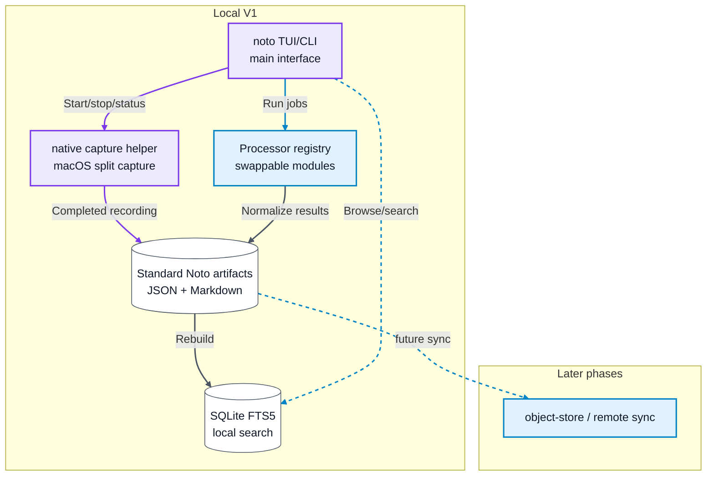

# Noto

Terminal-first meeting recorder, transcriber, summarizer, and searchable memory.

Noto's main interface is the `noto` TUI you open in the terminal. V1 records
meetings through a small native macOS capture helper behind the CLI, keeps
microphone and system/app audio as distinct sources, ingests recordings into
portable local artifacts, transcribes them, writes JSON and Markdown, indexes
them with SQLite FTS5, and lets you browse/search meetings from the TUI.

## Status

Planning phase. V1 is local-first: TUI, macOS recording, ingestion,
transcription, summaries, and search. Object-store sync, hosted APIs, hosted
provider routing, and local transcription are later phases. The active
documentation lives in [.docs](./.docs/README.md).

## Scope

| Release | Focus | Storage |
| --- | --- | --- |
| V1 | Terminal TUI/CLI, macOS recording helper, ingest, transcription, summaries, search | `~/Noto` |
| Later | Object-store sync, hosted/self-hosted gateway, local transcription | Filesystem, R2/S3, or Noto API |

## Command Shape

```text
noto
noto record --title "Roadmap sync"
noto stop
noto import-audio ./roadmap-sync.m4a --title "Roadmap sync"
noto import-transcript ./roadmap-sync.json --title "Roadmap sync"
noto search --json "pricing decision"
noto verify --json
noto show <meeting_id>
noto transcript --json <meeting_id>
```

## Architecture



## Documentation

- [Documentation index](./.docs/README.md)
- [Product reference](./.docs/reference/product.md)
- [Feature alignment](./.docs/reference/features.md)
- [Design sketches](./.docs/design.md)
- [User stories](./.docs/reference/user-stories.md)
- [Benchmarks](./.docs/reference/benchmarks.md)
- [TDD and validation](./.docs/reference/testing.md)
- [Build plan](./.docs/guides/build-plan.md)

## License

Source-available under the PolyForm Noncommercial License 1.0.0.

Commercial use requires a paid license. Commercial use includes use by
companies, employees, contractors, freelancers using Noto for client work, or
teams using it for internal business meetings, operations, documentation, or
agent workflows.
