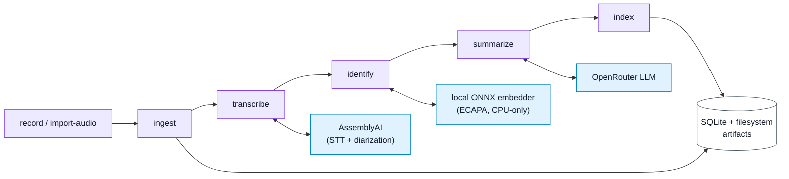

<div align="center">

# noto

**Terminal-first meeting recorder, transcriber, summarizer, and searchable memory, with persistent cross-meeting speaker identity.**

[](https://github.com/lukasstrickler/noto/actions/workflows/ci.yml)
[](go.mod)
[](#installation)
[](LICENSE)
[](#project-status)

<sub>Record or import a meeting · transcribe + diarize · summarize with citations · search everything · keep stable speaker identities across meetings — all from a keyboard-first TUI.</sub>

</div>

<!--
  A TUI demo GIF belongs right here. A vhs tape is ready at .docs/assets/noto.tape:
    make build && ./bin/noto seed && vhs .docs/assets/noto.tape
  then uncomment the line below:
  
-->

---

## Table of contents

- [Why noto](#why-noto)
- [Highlights](#highlights)
- [Quickstart](#quickstart)
- [How it works](#how-it-works)
- [Usage](#usage)
- [Speaker identity](#speaker-identity)
- [Development](#development)
- [For AI agents](#for-ai-agents)
- [Project status & roadmap](#project-status)
- [Documentation](#documentation)
- [License](#license)

---

## Why noto

Most meeting tools are a SaaS bot that joins your call, uploads everything, and hands you a
summary you can't audit. noto runs the other way around. It's a single Go binary you run in
your terminal. Audio, transcripts, summaries, the search index, and voice profiles live on a
backend you control (local by default, remote when you want it), and every summary claim is
cited back to a transcript segment you can jump to.

The same JSON/HTTP contract drives the TUI and a scriptable CLI, so an LLM agent can
`noto search --json` your meeting memory the same way you can. And the work that's usually
hand-waved is benchmarked here: a CPU-only cross-meeting
[speaker-recognition pipeline](#speaker-identity) with reproducible numbers, including the
conditions where it fails.

---

## Highlights

| | |
|---|---|
| 🎙️ **Record or import** | macOS capture helper (ScreenCaptureKit) for mic + system audio; `import-audio` for any existing file. |
| 📝 **Transcribe + diarize** | AssemblyAI STT with speaker diarization; dry-run fallback works without keys. |
| 🧠 **Cited summaries** | One LLM call per meeting: summary, decisions, actions, risks, questions — each citing a `segment_id`. |
| 👤 **Cross-meeting identity** | CPU-only ECAPA voice embeddings link the same person across meetings: 100% rank-1, 0 false merges on a 52-speaker AMI subset (ground-truth diarization). [See the numbers →](#speaker-identity) |
| 🔍 **Searchable memory** | SQLite FTS5 search; every result carries meeting, speaker, and timestamp. |
| 🤖 **Agent-native** | A stable `--json` CLI and HTTP/SSE endpoint for every workflow. |
| 🧩 **One client, three modes** | In-process, local daemon (Unix socket), or remote (TCP + token) — same code path. |
| ⌨️ **Keyboard-first TUI** | Bubble Tea v2; each key is defined once and every on-screen label derives from it. |

---

## Quickstart

> `go` does not need to be on your `$PATH` — the repo ships a toolchain shim that downloads a
> pinned Go into `./.tools/go` on first use.

```bash
git clone https://github.com/lukasstrickler/noto
cd noto

make dev            # build + open the TUI against a local in-process backend
make seed           # (optional) drop 3 fixture meetings in so there's something to browse
```

There's no server to stand up and no keys required to look around. To process real audio, add
an [AssemblyAI key](#usage); without one, noto runs a synthetic dry-run so the whole pipeline
still works end-to-end.

### Installation

| Method | Command |
|---|---|
| **From source** (recommended while alpha) | `git clone …/noto && cd noto && make build` → `./bin/noto` |
| **`go install`** | `go install github.com/lukasstrickler/noto/cmd/noto@latest` |
| **Run without building** | `make dev` (TUI) · `make serve` (backend) |

> Recording requires the **macOS** capture helper (`cmd/capture`, ScreenCaptureKit). Browsing,
> import, transcription, summarization, and search work on **macOS and Linux**.

---

## How it works

Audio enters the backend (recorded or imported) and flows through a staged, independently
retriable pipeline. The TUI is a thin client that only ever talks to the backend.


```mermaid
flowchart LR
    classDef stage fill:#ede9fe,stroke:#7c3aed,color:#111827
    classDef ext fill:#e0f2fe,stroke:#0284c7,color:#111827
    classDef store fill:#fff,stroke:#4b5563,color:#111827

    REC["record / import-audio"]:::stage
    ING["ingest"]:::stage
    TR["transcribe"]:::stage
    ID["identify"]:::stage
    SUM["summarize"]:::stage
    IDX["index"]:::stage

    AAI["AssemblyAI<br/>(STT + diarization)"]:::ext
    EMB["local ONNX embedder<br/>(ECAPA, CPU-only)"]:::ext
    LLM["OpenRouter LLM"]:::ext
    DB[("SQLite + filesystem<br/>artifacts")]:::store

    REC --> ING --> TR --> ID --> SUM --> IDX
    TR <--> AAI
    ID <--> EMB
    SUM <--> LLM
    IDX --> DB
    ING --> DB
```

- **ingest** registers the recording and its artifacts.
- **transcribe** sends audio to AssemblyAI → a normalized, provider-independent transcript
  (utterances, words, per-meeting diarization labels A/B/C, timings).
- **identify** embeds each diarized speaker locally and matches them against a persistent
  gallery → stable cross-meeting `profile_id`s and `Person N` placeholders that become real
  names everywhere once known.
- **summarize** makes **exactly one** LLM call, returning all categories as strict JSON with
  `segment_id` evidence.
- **index** updates the SQLite FTS5 search index (rebuildable from artifacts at any time).

Every stage writes normalized artifacts to the backend; provider payloads are kept only as
debug data, never as a downstream contract.

---

## Usage

Every command runs against an in-process backend by default; it auto-discovers a local daemon
or a remote server if one is configured (`NOTO_API_URL` → healthy local socket → in-process).
Every read command supports `--json`.

```text
# Capture & import
noto record --title "Roadmap sync"             # start a macOS recording
noto stop
noto import-audio <path> --title "…" --wait    # run the full pipeline on any audio/video file

# Browse, read, search
noto list                                      # recent meetings + status
noto show <id>                                 # meeting overview
noto transcript <id>                           # diarized transcript with segment IDs
noto summary <id>                              # cited summary: decisions, actions, risks, questions
noto search "pricing decision"                 # FTS5 search → segments with timestamps
noto play <id> [--speed <rate>]                # play back the recording

# Operate
noto serve [--listen tcp:0.0.0.0:8731 --token-file <f>]   # run the backend daemon
noto status                                    # recording / job / index state
noto verify                                    # checksum + schema validation
noto reindex                                   # rebuild the search index from artifacts
```

**Provider keys.** In the TUI, press `,` for the config screen, pick a provider, press `e`,
and paste the key. noto uses [AssemblyAI](https://www.assemblyai.com/) for transcription and an
OpenRouter-compatible LLM for summaries; without keys it runs a synthetic dry-run. Keys are
stored in the macOS Keychain, or `~/.noto/credentials.json` (mode `0600`) elsewhere.

**Remote backend.** Point any client at a server with two environment variables:

```bash
export NOTO_API_URL=http://192.168.1.10:8731
export NOTO_API_TOKEN=<token>
```

Full reference: [CLI & providers](.docs/cli.md) · [TUI](.docs/tui.md) ·
[agent interface](.docs/agent-interface.md).

---

## Speaker identity

Diarization tells you "speaker A said this"; it can't tell you that speaker A today is the same
person as speaker B last week. noto adds that missing layer with a local, CPU-only voice
pipeline: it embeds each diarized speaker with **ECAPA-TDNN-512** (WeSpeaker, ONNX), builds a
robust per-speaker centroid, and matches it against a persistent gallery by cosine similarity —
auto-confirming a link above 0.70 and surfacing 0.55–0.70 for one-click review.

This is the most heavily engineered part of the project, so it's benchmarked end-to-end through
the production matching code, and the results are reproducible.

**Benchmark environment**

| | |
|---|---|
| Hardware | AMD EPYC 7702P (64-core Zen 2), **CPU-only — no GPU** |
| Runtime | ONNX Runtime, 4 intra-op threads, via noto's production Go matcher |
| Dataset | [AMI Meeting Corpus](https://groups.inf.ed.ac.uk/ami/corpus/) subset — **52 speakers / 39 meetings**, single-channel Mix-Headset, ground-truth turns |
| Command | `PERSONA_DEEP=1 go test ./benchmark/identity/ -run Benchmark50` |

**Results** — enroll each speaker from one meeting, then identify them in their other meetings
against the full 52-speaker gallery (104 test personas, 5 304 impostor pairs):

| Metric | Result |
|---|---|
| Identification rank-1 | **100.0 %** |
| Verification EER | **0.00 %** (robust centroid; 0.09 % plain mean) |
| Embedding speed (CPU) | **~30× real time** — RTF 0.029, 24 MB model, 192-d |
| False auto-merges (link ≥ 0.70) | **0** |
| True links surfaced for review (≥ 0.55) | **100 %** |

On clean speech the genuine and impostor score distributions don't overlap (weakest genuine
0.623 > strongest impostor 0.596), so a single global threshold separates them cleanly and no
stranger is ever silently merged into someone else's profile.

<details>
<summary><b>Where it breaks</b> — failure modes from a degradation sweep</summary>

<br>

Re-running the same 52 speakers under realistic degradations shows the embedder is not the weak
point — the pipeline around it is:

| Condition | rank-1 | stranger false-accept | takeaway |
|---|---|---|---|
| clean baseline | 100.0 % | 5.1 % | reference |
| short speech (3 s) | 93.3 % | 3.9 % | identification survives |
| **upstream diarization confusion (15 %)** | 93.3 % | **39.7 %** | dominant production risk |
| **upstream diarization confusion (30 %)** | **58.7 %** | **62.8 %** | catastrophic — the centroid breaks down |
| **telephone band (8 kHz)** | 100.0 % | **52.6 %** | open-set rejection collapses |

Short speech and narrowband audio barely move identification. The real damage comes from
**upstream diarization errors** (mislabeled turns poison the enrollment centroid) and **channel
mismatch** (open-set rejection of strangers), neither of which is visible in the happy-path
numbers. The matcher's mitigations — robust medoid-anchored aggregation, a top-1-vs-top-2 margin
gate, a minimum-enrollment-speech gate, and precision-first 0.70 / 0.55 thresholds — are each
documented against the data that justified them.

</details>

Voice embeddings are biometric data and never leave the backend: audio is sent to AssemblyAI for
transcription only, never for identity.

📊 Full method, the model-selection study, raw numbers, and dataset provenance in
**[benchmarks](.docs/benchmarks.md)** · design rationale in
**[speaker identity](.docs/speaker-identity.md)**.

---

## Development

```bash
make dev            # run the TUI from source
make serve          # run the backend daemon from source
make build          # produce ./bin/noto
make test           # go test ./...
make test-race      # race detector
make check          # fmt-check + vet + lint + test  (the gate CI enforces)
make help           # all targets
```

CI ([`.github/workflows/ci.yml`](.github/workflows/ci.yml)) runs gofmt, `go vet`, build,
`go test -race`, and golangci-lint on every push and PR. New to the code? Start with
[AGENTS.md](AGENTS.md) and [CLAUDE.md](CLAUDE.md) for the conventions, then run `make check`
before opening a PR.

---

## For AI agents

noto is built to be operated by coding assistants and LLM agents, not only by people.

<details>
<summary><b>Working in this repository</b> — build, test, conventions</summary>

<br>

`go` may not be on `$PATH`; the repo ships a toolchain shim, so prefer the `make` targets.

```bash
make build      # produce ./bin/noto
make test       # go test ./...
make check      # fmt-check + vet + lint + test — run before proposing a diff (this is the CI gate)
```

Conventions that tests enforce (read [AGENTS.md](AGENTS.md) and [CLAUDE.md](CLAUDE.md) first):

- **Storage seam.** Service code imports `internal/platform/repo`, never the concrete
  `internal/platform/storage`. A test asserts this.
- **Keybindings are single-source.** Add a `key.Binding` in `internal/ui/tui/keys`, handle it
  with `key.Matches`, render it with a chip helper. Never compare `msg.String() == "x"` for a
  discoverable action. Top-level screen numbers are auto-assigned from `topScreens`.
- **Layout goes through `layout.Split`.** No hand-rolled `width/3` or `total - other - 1`.
- **Core stays ML-free.** Embedding/matching lives in `internal/platform/providers/speaker`;
  `internal/core/speakers` is pure decision logic.

</details>

<details>
<summary><b>Querying meeting data</b> — stable JSON / HTTP contract</summary>

<br>

Every read command takes `--json` and emits a stable, versioned shape keyed by stable IDs
(`meeting_id`, `segment_id`, `speaker_id`, `speaker_profile_id`). Build on this; provider
payloads are debug data, not a contract.

```bash
noto agent <meeting_id> --json   # handoff: artifact paths + ready-to-run commands for a meeting
noto list --json                 # discover meeting IDs and status
noto search --json "query"       # cited segments: meeting, segment_id, speaker, timestamp
noto transcript --json <id>      # normalized source evidence
noto summary --json <id>         # orientation only — verify claims against the transcript
noto status --json               # recording / job / index state
noto verify --json               # checksum + schema validation
```

Errors go to stderr as `{"error": {"code", "message", "details"}}` with machine-readable codes.
The same operations are available over HTTP/SSE against a daemon (`NOTO_API_URL` +
`NOTO_API_TOKEN`). Treat summaries as orientation and cite a transcript `segment_id` for any
factual claim. Full contract: [agent interface](.docs/agent-interface.md) ·
[artifact schemas](.docs/artifacts.md).

</details>

---

## Project status

**Alpha.** The end-to-end pipeline (record/import → transcribe → identify → summarize → index →
search), the TUI, the CLI/JSON + HTTP/SSE contract, the three deployment modes, and the storage
seam all work today. Speaker identity is **built and verified end-to-end** in-process (pure-Go
fbank + ONNX ECAPA embedder, wired into the transcribe job, benchmarked above).

**On the roadmap:**

- [ ] Extract `identify` as a standalone, re-runnable voice service
- [ ] One-step model install into the data dir (`noto speaker-model download`)
- [ ] Surface profile identity (badges: ✓ matched / ? suggested / + new) on the transcript
- [ ] Per-word confidence weighting (the real fix for upstream diarization errors)
- [ ] People screen — cross-meeting view of a person → meetings, talk-time, regulars
- [ ] `noto serve install` (systemd / launchd) + first-class remote-backend config

---

## Documentation

| Topic | Link |
|---|---|
| Documentation index | [.docs/README.md](.docs/README.md) |
| Architecture, deployment modes & package map | [.docs/architecture.md](.docs/architecture.md) |
| Speaker-identity design | [.docs/speaker-identity.md](.docs/speaker-identity.md) |
| **Benchmarks, failure modes & datasets** | [.docs/benchmarks.md](.docs/benchmarks.md) |
| CLI reference & providers | [.docs/cli.md](.docs/cli.md) |
| Agent / HTTP interface | [.docs/agent-interface.md](.docs/agent-interface.md) |
| Artifact schemas | [.docs/artifacts.md](.docs/artifacts.md) |
| TUI reference (screens & keys) | [.docs/tui.md](.docs/tui.md) |
| Architecture decision records | [.docs/decisions/](.docs/decisions/) |

---

## License

Source-available under the [PolyForm Noncommercial License 1.0.0](LICENSE).

Commercial use requires a paid license. Commercial use includes use by companies, employees,
contractors, or freelancers using noto for client work, and teams using it for internal
business meetings, operations, documentation, or agent workflows.

<sub>Speaker embeddings are derived **biometric data**. noto keeps all audio and embeddings
local/server-side, supports per-person delete/forget, and can disable voice identity entirely.</sub>
