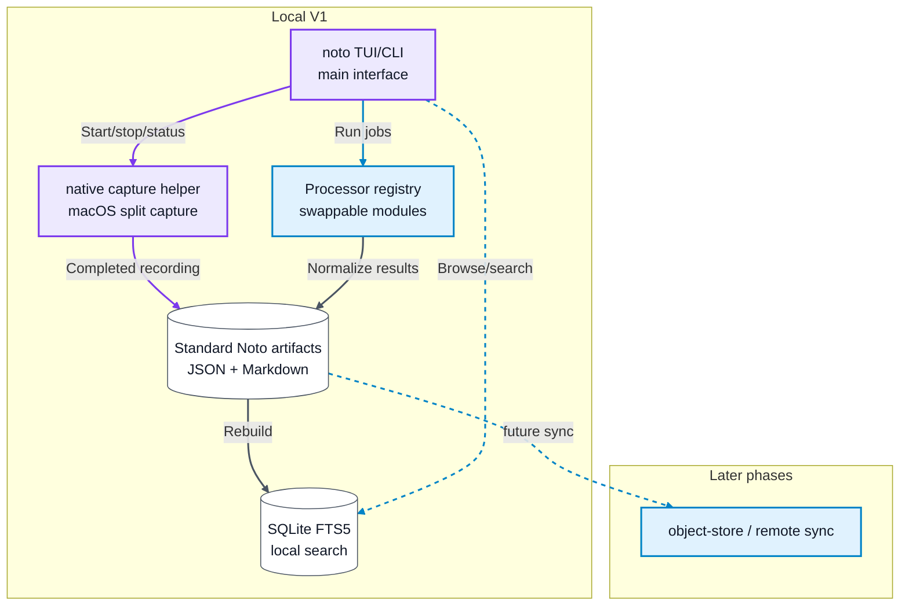

# Noto

Terminal-first meeting recorder, transcriber, summarizer, and searchable memory.

Noto's main interface is the `noto` TUI you open in the terminal. V1 records
meetings through a small native macOS capture helper behind the CLI, keeps
microphone and system/app audio as distinct sources, ingests recordings into
portable local artifacts, transcribes them, writes JSON and Markdown, indexes
them with SQLite FTS5, and lets you browse/search meetings from the TUI.

## Status

Implementation alpha. V1 is local-first: a Bubble Tea TUI talking to an
in-process HTTP server, macOS recording via a Swift helper, async ingest /
transcribe / summarize / index jobs, and SQLite FTS5 search. Object-store
sync and a hosted gateway remain later phases.

## Quickstart

```bash
# from a checked-out repo
make dev           # opens the TUI, auto-warms the capture helper
```

If Go isn't installed system-wide, `make dev` downloads a local toolchain into
`./.tools/go/` on first run — see `scripts/go`. Active documentation lives in
[.docs](./.docs/README.md).

### Provider keys

Open the TUI, press `,` (or `4`) to land on the **config** screen. The left
pane shows what's active and where artifacts live. The right pane lists
providers — pick one, press `e`, paste the key. Keys persist via macOS
Keychain on darwin and `~/.noto/credentials.json` (0600) elsewhere. `a` on a
highlighted speech provider makes it the active route.

The V1 defaults are tuned for AssemblyAI (speaker labels on by default).
A `local` provider entry talks to any OpenAI-compatible STT server — point
`NOTO_LOCAL_STT_URL` at e.g. whisper.cpp's HTTP server or NVIDIA NIM
Parakeet to keep transcription on-device.

## Scope

| Release | Focus | Storage |
| --- | --- | --- |
| V1 | Terminal TUI/CLI, macOS recording helper, ingest, transcription, summaries, search | `~/Noto` |
| Later | Object-store sync, hosted/self-hosted gateway, local transcription | Filesystem, R2/S3, or Noto API |

## Command Shape

```text
noto
noto record --title "Roadmap sync"
noto stop
noto import-audio ./roadmap-sync.m4a --title "Roadmap sync"
noto import-transcript ./roadmap-sync.json --title "Roadmap sync"
noto search --json "pricing decision"
noto verify --json
noto show <meeting_id>
noto transcript --json <meeting_id>
noto play <meeting_id> [--speed <rate>]
```

## Architecture


```mermaid
flowchart TD
    classDef appNode fill:#ede9fe,stroke:#7c3aed,stroke-width:2px,color:#111827;
    classDef coreNode fill:#e0f2fe,stroke:#0284c7,stroke-width:2px,color:#111827;
    classDef storageNode fill:#ffffff,stroke:#4b5563,stroke-width:1px,color:#111827;

    subgraph Local["Local V1"]
        CLI["noto TUI/CLI<br/>main interface"]:::appNode
        APP["native capture helper<br/>macOS split capture"]:::appNode
        PROC["Processor registry<br/>swappable modules"]:::coreNode
        ART[(Standard Noto artifacts<br/>JSON + Markdown)]:::storageNode
        FTS[(SQLite FTS5<br/>local search)]:::storageNode
    end

    subgraph Later["Later phases"]
        SYNC["object-store / remote sync"]:::coreNode
    end

    CLI -->|Start/stop/status| APP
    APP -->|Completed recording| ART
    CLI -->|Run jobs| PROC
    PROC -->|Normalize results| ART
    ART -->|Rebuild| FTS
    CLI -->|Browse/search| FTS
    ART -.->|future sync| SYNC

    linkStyle 0 stroke:#7c3aed,stroke-width:2px;
    linkStyle 1 stroke:#7c3aed,stroke-width:2px;
    linkStyle 2 stroke:#0284c7,stroke-width:2px;
    linkStyle 3 stroke:#4b5563,stroke-width:2px;
    linkStyle 4 stroke:#4b5563,stroke-width:2px;
    linkStyle 5 stroke:#0284c7,stroke-width:2px,stroke-dasharray:5 5;
    linkStyle 6 stroke:#0284c7,stroke-width:2px,stroke-dasharray:5 5;
```

## Documentation

- [Documentation index](./.docs/README.md)
- [Product reference](./.docs/reference/product.md)
- [Feature alignment](./.docs/reference/features.md)
- [Design sketches](./.docs/design.md)
- [User stories](./.docs/reference/user-stories.md)
- [Benchmarks](./.docs/reference/benchmarks.md)
- [TDD and validation](./.docs/reference/testing.md)
- [Build plan](./.docs/guides/build-plan.md)

## License

Source-available under the PolyForm Noncommercial License 1.0.0.

Commercial use requires a paid license. Commercial use includes use by
companies, employees, contractors, freelancers using Noto for client work, or
teams using it for internal business meetings, operations, documentation, or
agent workflows.
